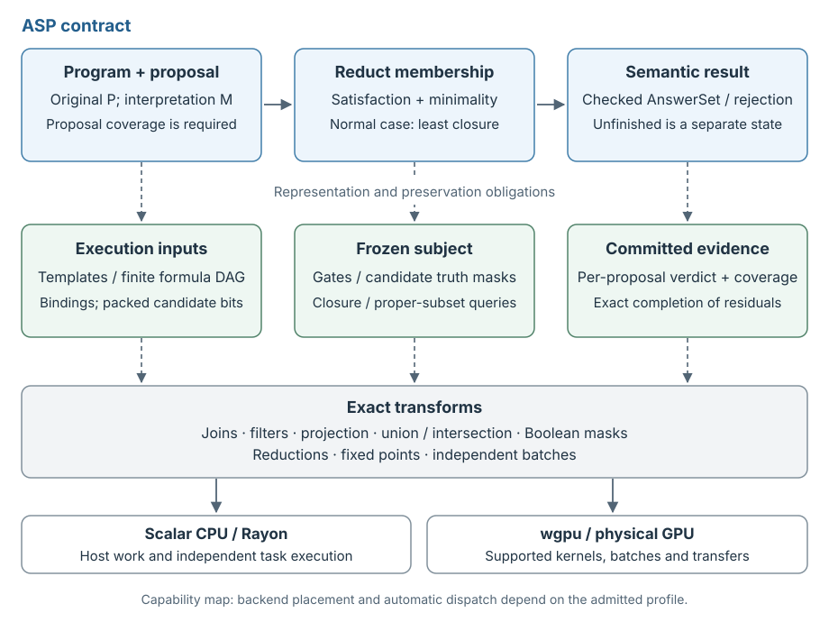

# From answer-set semantics to exact transforms

zetesis has two complementary vocabularies. The semantic layer speaks about
programs, interpretations, satisfaction, reducts and answer sets. The execution
layer speaks about relations, masks, reductions, fixed points and batches. The
connection between them is the architecture: each execution operation must
implement a stated logical operation, and composition must preserve its subject
and completion conditions.



The vertical arrows indicate representation obligations. They are not claims
that every Rust or WGSL correspondence has been formally proved. The horizontal
semantic path remains the same across execution strategies.

The pseudocode specifies finite, admitted inputs. Every bounded operation must
either finish or return an explicit stop; a stop propagates as unfinished work.
It must never be interpreted as an empty result, a false formula or exhaustion.

## What the transformer inspiration means

The hardware opportunity is to express repeated logical work through a small
algebra of composable operations on many interpretations and shared immutable
program data. Packing truth values, retaining reusable representations, fusing
equivalent operations and evaluating independent rows can make that work suitable
for modern CPUs and GPUs.

Here a **transform** is an exact operation, not a trained approximation. There
are no learned weights, attention scores or floating-point truth values. In the
Lean foundation, a `Transformer` is specifically a function from a set of atoms
to a set of atoms. Not every execution operation has that type: a join binds
tuples, a satisfaction test returns truth, and a frozen-reduct constructor retains
an interpretation-dependent view. Their individual contracts make composition
meaningful.

This does not require every operation to become dense matrix multiplication.
Sparse joins, bitwise operations and integer reductions often preserve the
problem's structure more directly. Efficient scheduling follows the representation
and its dependencies; it does not change the answer-set definition.

The pseudocode below exposes those compositions before discussing scheduling.
`Bind`, `Filter`, `Gate` and `Project` are actual definitions in the lifted Lean
model. Names such as `FoldDAG` and `RootValues` describe operations in the Rust
implementation; they do not assert that all stages already share an executable
combinator API. Relations, atom sets, truth arrays and completion evidence remain
different types of value.

| ASP operation | Execution interpretation | Where to read the implementation |
| --- | --- | --- |
| Instantiate a rule body | Join positive witnesses, agree on repeated variables, filter scalar conditions, project an instance | [`source::scan`](https://github.com/GregoryGelfond/zetesis/blob/main/crates/zetesis-cpu/src/oracle/source.rs); [source preparation](grounding.md) |
| Determine the normal reduct | Evaluate positive/negative gates against one immutable seed | [`check_static`](https://github.com/GregoryGelfond/zetesis/blob/main/crates/zetesis-cpu/src/static_oracle.rs) |
| Derive positive consequences | Test enabled bodies, union their heads, repeat until closed | [`check_static`](https://github.com/GregoryGelfond/zetesis/blob/main/crates/zetesis-cpu/src/static_oracle.rs); [lazy batches](../rust/parallel.md) |
| Test formula satisfaction | Evaluate an acyclic Boolean graph; require every asserted root | [`models`](https://github.com/GregoryGelfond/zetesis/blob/main/crates/zetesis-ferraris/src/oracle.rs) |
| Construct and reuse a formula reduct | Freeze candidate truth at every graph node; mask candidate-false nodes during later queries | [`FrozenReduct`](https://github.com/GregoryGelfond/zetesis/blob/main/crates/zetesis-ferraris/src/reduct.rs) |
| Establish subset minimality | Search for a proper-subset reduct model; propagate Boolean domains and exactly complete unresolved queries | [`zetesis-sat`](https://github.com/GregoryGelfond/zetesis/blob/main/crates/zetesis-sat/README.md); [`GpuFormulaOracle`](https://github.com/GregoryGelfond/zetesis/blob/main/crates/zetesis-wgpu/README.md) |
| Evaluate an aggregate | Coalesce complete tuple identities, combine eligibility, then reduce count/sum/extrema | [Native aggregate operations](https://github.com/GregoryGelfond/zetesis/blob/main/crates/zetesis-wgpu/README.md#native-numeric-aggregates) |
| Check several proposals | Share program data while keeping each interpretation, reduct and verdict separate | [`BatchOracle`](../rust/parallel.md); [commit boundaries](execution.md#immutable-rounds-and-commit-boundaries) |

These are capability mappings. Ordinary relational solving supports lazy source
rounds, Rayon and GPU closure. Ordinary formula solving currently grounds eagerly
and combines host candidate search with optional GPU propagation and exact host
completion. Native aggregate and GPU tight-program operations are explicit
library capabilities; ordinary dispatch does not automatically use them.

## Positive inference is a composition with a fixed point

Consider `reachable(Y) :- reachable(X), open(X,Y), not blocked(Y).`
Binding joins `reachable` and `open`; a candidate-fixed gate checks `blocked`;
projection produces `reachable(Y)`. Union combines consequences from all rules.
For a fixed candidate `M`, write the resulting consequence operation as `T_M`.

The four primitives have separate subjects. `Bind(t)` maps an interpretation to
the substitutions whose positive antecedents hold. `Filter(t)` retains bindings
satisfying the template's scalar conditions. `Gate(t, M)` retains bindings whose
true/false gates agree with the immutable candidate. `Project(t)` maps surviving
bindings to head atoms, coalescing duplicate heads at the set level.

With composition read from right to left, the normal-program pipeline is:

```text
Rows(t, M)          = Gate(t, M) ∘ Filter(t) ∘ Bind(t)
RuleTransform(t, M) = Project(t) ∘ Rows(t, M)
T_M(X)              = Union { RuleTransform(t, M)(X) | t is a head rule of P }
Gamma(P, M)         = Least(T_M)

ConstraintTriggered(c, M, X) = Exists(Rows(c, M)(X))
ConstraintsOK(P, M, X)       = NOT Exists { c | c is a constraint of P
                                             AND ConstraintTriggered(c, M, X) }

NormalMembership(P, M) = Equal(Gamma(P, M), M) AND ConstraintsOK(P, M, M)
```

This is [the lifted rule composition](https://github.com/GregoryGelfond/zetesis/blob/main/proofs/Zetesis/Lifted.lean),
followed by the closure and constraint condition in
[`Semantics.stable_iff_gamma`](https://github.com/GregoryGelfond/zetesis/blob/main/proofs/Zetesis/Semantics.lean).
Fixing `M` supplies the normal reduct by fixing its gates; it need not allocate
a second program. Constraints reuse the binding/filter/gate pipeline but finish
with an existential reduction instead of head projection. Facts contribute
without positive antecedents. The binding relations specify valid substitutions;
the notation does not require materializing their entire carrier.

For the positive normal reduct, `T_M` is monotone. Its least closure is realized
by the inflationary recurrence:

```text
X_0     = empty interpretation
X_(n+1) = Union(X_n, T_M(X_n))
Gamma(P, M) = X_n when a complete round establishes X_(n+1) = X_n
```

**Invariant:** `X` is contained in the least closure of the frozen positive
rules. Every changing round adds an atom; a finite carrier bounds such rounds.
An unchanged *complete* scan proves closure. Together these facts establish
leastness; equality with `M` supplies the answer-set test.

The bounded implementation lifts these logical operations into explicit
completion results. Only a completed membership decision can be classified:

```text
Completed(true)  => Accepted(M)
Completed(false) => Rejected
Stopped(reason) => Unfinished(reason)
```

A witnessed constraint can refute membership immediately. An empty *prefix* of
its bindings cannot establish that no violation exists. Likewise, a source scan
must cover the current `X` and frozen `M` before its unchanged output certifies
closure. These obligations belong to the primitives' realization, not just to
the outer loop.

The relational implementation can propose only a **gate seed**, compute its
closure `X`, and compare `X`'s gate projection with that seed:

```text
X = Gamma(P, z)
AcceptSeed(P, S, z) = Equal(X intersection S, z) AND ConstraintsOK(P, z, X)
```

Here `S` contains every gate atom, and `z` denotes the gates selected true; other
atoms of `S` are selected false. This avoids guessing every derived atom. The
resulting `X`, not the seed alone, is the answer interpretation.
Eager scans and lazy joins implement this same contract. Shared lazy scans may
offer instances from a union of worlds, but each world must recheck its own
antecedents before deriving a head.

This least-closure procedure applies to the admitted normal profile. A positive
disjunctive program may have several incomparable minimal models, so the general
oracle below retains subset minimality.

## Satisfaction and the reduct share one graph

Let the original finite theory `T` be a directed acyclic graph whose children
precede their parents. A node denotes an atom, falsum, conjunction, disjunction
or implication. Classical evaluation composes local truth operations with a
topological fold and a reduction over asserted roots. Define the local operation
using the already computed child values `V`:

```text
NodeTruth(I, Atom(a),             V) = Member(I, a)
NodeTruth(I, Falsum,              V) = false
NodeTruth(I, And(left,right),     V) = V[left] AND V[right]
NodeTruth(I, Or(left,right),      V) = V[left] OR V[right]
NodeTruth(I, Implies(left,right), V) = NOT V[left] OR V[right]

Truth(T, I)  = FoldDAG(NodeTruth(I), T)
Models(T, I) = All(RootValues(T, Truth(T, I)))

frozen = Truth(T, M)                         // immutable, bound to T and M
ReductNode(J, node, V) = NodeTruth(J, node, V) AND frozen[node]
ReductTruth(T, M, J)   = FoldDAG(ReductNode(J), T)
ModelsReduct(T, M, J)  = All(RootValues(T, ReductTruth(T, M, J)))

Countermodel(T, M, J) = ProperSubset(J, M) AND ModelsReduct(T, M, J)
GeneralMembership(T, M) = All(RootValues(T, frozen))
                         AND NOT Exists(J => Countermodel(T, M, J))
```

`FoldDAG` visits children before their parents; `RootValues` gathers the asserted
roots and `All` reduces their truth values. The reduct changes the node operation
by composing it with the fixed candidate mask. Its parents consume the *masked*
child values. Masking only after an ordinary evaluation of the whole graph would
not implement this definition. Default negation is implication to falsum and
uses the same construction; double negation cannot be collapsed to an atom.

**Invariant:** after each graph step, the stored value is that node's classical
truth, or its reduct truth when a frozen mask is supplied. The mask belongs to
the original `M` for the entire query. The countermodel search ranges over
`J ⊊ M`, excluding `M` itself; its exhaustion must establish coverage of that
space. For an empty `M`, there are no proper subsets. After candidate satisfaction
has completed successfully, the existential question has three distinct outcomes:

```text
Found(J)        => RejectedWithCounterexample(J)
Exhausted       => Accepted(M)
Stopped(reason) => Unfinished(reason)
```

The small reference checker explicitly enumerates subsets. Ordinary solving
uses propagation and native search to discharge the same existential question.
On the GPU, Boolean domains can be narrowed by many local gate operations. A
propagation fixed point may leave choices unresolved, so it returns residual
work for exact host completion. A class certificate can justify a cheaper exact
membership test when its premises hold.

The opportunities for parallelism have different dependencies: candidates and
frozen-subset queries are independent, while nodes depend on their children and
closure rounds depend on earlier consequences. Parallel evaluation must respect
those dependencies. Reusing a frozen mask is useful even on one CPU thread.

## Batch the question, preserve every obligation

Candidate generation and membership checking have separate completeness
requirements. A source generator can reduce materialization, and a search
generator can avoid already excluded interpretations, provided neither loses an
answer of the original program.

The scheduling layer applies the appropriate membership composition to
independent subjects:

```text
BatchCheck(P, proposals) = Map(proposal => Check(P, proposal), proposals)
```

This denotes an independent map, not a new uniform backend API. It does not
require every backend to implement an identical loop or commit granularity.
Completed verdicts are committed to their corresponding proposals; interrupted
or uncompleted obligations remain pending and prevent an exhaustion claim.
Generator feedback must preserve every answer still to be found. Candidate rows
cannot share truth by accident. A rejected proposal, a pending query and a committed answer remain
different states. General subset blocking is not licensed merely by finding an
answer: for example, `{a}.` admits both the empty answer and `{a}`.

Objective selection and display follow checked answers. Complete unrestricted
enumeration plus complete retention can construct a `WorldView`; optimal ties
and projected displays have different contracts. Batched execution must account
for every proposal before claiming exhaustion.

## The correspondence in Lean

[`Lifted.lean`](https://github.com/GregoryGelfond/zetesis/blob/main/proofs/Zetesis/Lifted.lean)
defines the four rule primitives and `RuleTransform`. `composition_exact` equates
their composition with direct rule consequence; `ruleTransform_monotone` proves
growth under positive input. `family_exact`, `materialized_constraint_exact` and
`lazy_step_exact` require source coverage for the actual candidate and consequence
snapshot. An exhausted materialization queue alone is insufficient.

[`Transformers.lean`](https://github.com/GregoryGelfond/zetesis/blob/main/proofs/Zetesis/Transformers.lean)
defines composition, parallel union, filters, relational image, least closure
and world-indexed batches. `finiteIter_sound` and `finiteIter_exact_if_closed`
capture the positive-inference argument. `least_batch` states that independent
worlds retain their individual least closures. `fusion_preserves_least` requires
pointwise equivalence of the substituted operations, not agreement on one run.

[`Semantics.stable_iff_exists_seed`](https://github.com/GregoryGelfond/zetesis/blob/main/proofs/Zetesis/Semantics.lean)
connects accepted seed projection and its closure to answer sets, under the
explicit gate-carrier hypothesis.

[`NormalFerraris.ferraris_answer_set_iff_closure`](https://github.com/GregoryGelfond/zetesis/blob/main/proofs/Zetesis/NormalFerraris.lean)
connects normal-rule closure to formula answer-set semantics.
[`Ferraris.lean`](https://github.com/GregoryGelfond/zetesis/blob/main/proofs/Zetesis/Ferraris.lean)
defines satisfaction, the formula reduct and subset minimality; the
[theorem map](../lean/theorems.md) links the execution and coverage laws.
These are mathematical bridges. Establishing that concrete source lowering,
packed layouts, Rust operations and shaders implement them remains part of the
[refinement boundary](../lean/correspondence.md).

## Relation to clingo

clingo combines the gringo grounder with clasp. clasp is an ASP solver whose
primary algorithm uses conflict-driven nogood learning; it also provides
multithreaded search and dedicated cardinality/weight propagation. Its use of
Boolean solving techniques does not reduce its semantics to ordinary SAT.
See Potassco's descriptions of [clingo](https://potassco.org/clingo/) and
[clasp](https://potassco.org/clasp/).

zetesis makes candidate coverage and exact reduct membership explicit composition
boundaries, then maps their operations to shared source scans, packed data,
Rayon tasks and wgpu batches. This separation is the basis for its hardware
experiments and proof obligations. Parallelism alone is not a distinction from
clasp, and this comparison does not classify every earlier ASP architecture.
The [grounding comparison](grounding-comparison.md) explains the materialization
boundary; measured benefits depend on the input and executed profile.
