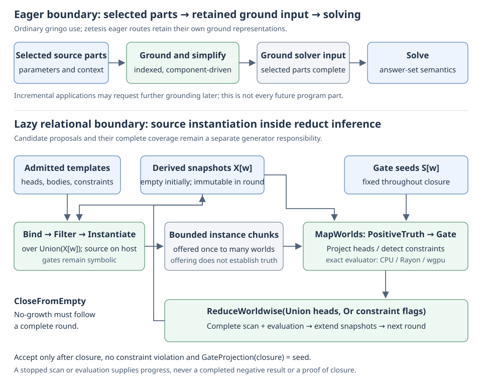

# Grounding compared with clingo

The useful distinction is when instances are generated, what is retained and
how inference is scheduled. Both an eager and a lazy implementation can be
described relative to a finite ground program; only one may need to materialize
that complete program. Neither scheduling choice changes zetesis's reduct-based
acceptance criterion.

## Compare execution boundaries

| Route | What happens before membership checking | What must be complete |
| --- | --- | --- |
| clingo ordinary grounding | Selected source parts are instantiated and simplified into ground input for solving | Grounding of those selected parts in their parameter/incremental context |
| zetesis eager formula | Possible support is completed and a finite atom catalog, shared formula DAG, objectives and observations are constructed | Source lowering and every relevant original formula/metadata obligation |
| zetesis eager relational | A bounded complete graph is compiled explicitly from relational templates | The retained ground instances and graph identity |
| zetesis lazy relational | Templates remain available; source joins generate instances during frozen-gate positive inference | Final closure coverage and constraints, plus separately complete candidate enumeration |

These routes do not have equal language coverage. The
[language reference](../reference/language.md) identifies the current profiles.
General lazy formula grounding, including arbitrary bounded choice groups, is
not yet implemented.



Three operations must remain distinct. **Source instantiation** produces bound
rule instances. **Candidate generation** proposes interpretations, or gate seeds
whose closures will supply interpretations. **Positive inference** derives atoms
under a frozen seed. Lazy relational checking composes instantiation with
inference; it does not identify a proposed atom with a derived atom or eliminate
the candidate generator's coverage obligation.

## Read grounding as a composition

The following notation emphasizes the [exact transforms](alignment.md), not a
particular loop nest. `∘` denotes composition, read from right to left. `Map`
preserves independent subjects; `Reduce` combines results using the stated
operation. `CloseFromEmpty` denotes inflationary consequence iteration through a
*complete* no-growth round. These are descriptions of contracts, not a claim that every name below
is an exported Rust combinator. Every operation may instead stop explicitly;
an unfinished stream cannot supply a fixed-point or exhaustion result.

For eager grounding, the conceptual boundary is:

```text
source parts and parameters
    |> AnalyzeDependencies
    |> InstantiateAndSimplifyToCompletion
    |> RetainGroundInput
    |> Solve
```

This is a boundary sketch for ordinary gringo use, not pseudocode for its full
algorithm. Internally, instantiation already uses indexed binding, component
scheduling and evolving grounding domains. Simplification can change the
representation emitted to the solver. Completion concerns the selected parts
and context, not every part that an incremental application might later request.
zetesis's eager paths have the same broad materialization boundary while
retaining their own relational or formula representations.

For zetesis's admitted lazy relational profile, the source operation is:

```text
Offer_t(X) = Instantiate_t ∘ Filter_t ∘ Bind_t (X)
Offer_P(X) = Concatenate(Map(Offer_t(X), templates(P)))
```

`Bind` joins positive witnesses and checks variable agreement. `Filter` evaluates
admitted scalar conditions. `Instantiate` retains the head, positive antecedents
and symbolic gates. A fact has an empty positive body, whose binding is the unit
substitution, so it can contribute even when `X` is empty. Source scans cover
constraints as well as headed rules.

A shared round then composes that offering with world-specific evaluation.
Here `S[w]` is the immutable gate seed, `X[w]` the immutable derived snapshot
and `V[w]` the retained constraint flag for world `w`; `C` is one bounded chunk
of offered instances.

```text
Enabled_w = Gate(S[w]) ∘ PositiveTruth(X[w])
Heads_w(C) = Reduce(Union) ∘ Map(Head) ∘ SelectHeaded ∘ Enabled_w (C)
Bad_w(C)   = Reduce(Or) ∘ Map(True) ∘ SelectConstraints ∘ Enabled_w (C)

Round_S(X, V) =
    Offer_P(Reduce(Union, X))
    |> BoundedChunks
    |> Map(C => MapWorlds(w => (Heads_w(C), Bad_w(C))))
    |> ReduceWorldwise((Union, Or))
    |> RequireCompleteSourceAndEvaluation
    |> MapWorlds((w, H, B) => (X[w] union H, V[w] or B))

closures, violations = CloseFromEmpty(
    Round_S, initial = (all empty, all false),
    complete_when = the completed round adds no head)
verdicts = MapWorlds(w =>
    Accept(closures[w]) iff
        not violations[w] and GateProjection(closures[w]) = S[w])
```

`Head` is projection of a retained instance; constraints have no head and go
through the separate Boolean reduction. `PositiveTruth` is essential: a union
join can offer a binding whose antecedents belong to different worlds. It is
neither a proof of truth in any one world nor permission to mix their seeds.
`Gate` consults only `S[w]`; it does not change as `X[w]` grows.

Precisely, an instance is enabled when its positive antecedents are a subset of
`X[w]`, its true-gate atoms are a subset of `S[w]`, and its false-gate atoms are
disjoint from `S[w]`. If `G_P` is the admitted program's gate carrier, then
`GateProjection(X) = X ∩ G_P`. The separate
[`Candidates`](https://github.com/GregoryGelfond/zetesis/blob/main/crates/zetesis-cpu/src/candidates.rs)
generator owes complete coverage of the relevant seeds over that carrier.

All chunks in one round read the same snapshots. Chunk results can be reduced
with associative union and disjunction; their new heads become source witnesses
only in the next round. Retaining a triggered constraint is sound because
positive truth grows under fixed gates. A successful no-growth round must have exhausted the
source scan and all required evaluations. Only then do sound derivation from
empty, closure, constraint checking and seed agreement establish acceptance.
An interrupted round supplies progress, not a negative answer or a completed
check. The current shared implementation returns no completed candidate checks
if that batch's required work stops.

This exposes two kinds of parallel work: common source instances can be reused
across worlds, and enabled instances can contribute through independent truth
tests and reductions. It also exposes the ordering that must remain: a later
round depends on the prior round's completed consequences. World-membership
masks may narrow offered bindings while preserving every world's enabled ones;
they change source work, not the formula above or candidate coverage.

The implementation connects at
[`source::scan`](https://github.com/GregoryGelfond/zetesis/blob/main/crates/zetesis-cpu/src/oracle/source.rs),
[`lazy::check_with_source`](https://github.com/GregoryGelfond/zetesis/blob/main/crates/zetesis-cpu/src/lazy.rs),
the [shared Rayon evaluator](https://github.com/GregoryGelfond/zetesis/blob/main/crates/zetesis-cpu/src/lazy/shared.rs)
and the [wgpu evaluator](https://github.com/GregoryGelfond/zetesis/blob/main/crates/zetesis-wgpu/src/lazy.rs).
The source scan and round coordinator run on the host; the injected evaluator
executes the per-world positive/gate tests and head/constraint reductions.
The composition is meaningful without claiming that source joins run on the GPU.

[`LazyRounds.lean`](https://github.com/GregoryGelfond/zetesis/blob/main/proofs/Zetesis/LazyRounds.lean)
formalizes the corresponding obligations: `union_scan_covers_world`,
`world_consequences_exact`, `world_constraints_exact`, `chunk_concatenation`
and `completed_round_exact`. Concrete Rust traversal, packed storage and WGSL
refinement remain outside those theorems' established correspondence.

## Follow a candidate-dependent join

```asp
{{#include ../../../examples/lazy-reachability.lp}}
```

One answer set contains `blocked` and the two edge facts. The other contains
`start(1)`, `reach(1)`, `reach(2)`, `reach(3)` and the edge facts. In a lazy check
whose seed selects `blocked`, no `start` or `reach` consequence is derived, so
the positive reachability joins have no matching rows. A seed selecting
`start(1)` enables those consequences over successive rounds.

The check begins with an empty derived interpretation, not with all seed atoms
asserted as facts. The independent scalar evaluator combines complete bootstrap
with later first-new row selections and completed consequence/constraint history.
Its final no-growth round establishes closure through that history. Shared-world
source traversal above retains complete round scans. In either schedule,
constraints and agreement with the seed still have to hold. This example
explains a work schedule. It does not, by itself, establish a speedup or a memory reduction.

From the repository root, compare the complete answer families directly:

```sh
zetesis examples/lazy-reachability.lp --grounder eager --backend cpu --models 0 --stats
zetesis examples/lazy-reachability.lp --grounder lazy --backend cpu --models 0 --stats
clingo examples/lazy-reachability.lp 0
```

Answer order is immaterial. Both families above must be present, with all edge
facts retained. On an accessible Metal device, the second command can instead
use `--backend metal`; inspect its statistics to confirm the executed route.
This tiny example tests meaning and routing, not throughput. For broader
reproduction, the [validation guide](../reference/validation.md) links maintained
corpora, physical checks and matched comparison schedules, with their limits and
reported observations. A performance claim needs its exact program, configuration,
completion evidence and measurement population as well as an elapsed time.

## What clingo already avoids

gringo does not enumerate an indiscriminate Cartesian product of every variable
over every constant. In the inspected clingo 5.8.2 implementation, predicate
domains have bound and full indexes, with `NEW`, `OLD` and `ALL` generations.
Dependency components, an instantiation queue and generation updates limit
repeated grounding work. The instantiator uses binding dependencies when
backjumping through a join. Indexed joins, component analysis and delta-based
iteration are therefore not unique to zetesis. See the pinned
[domain indexes](https://github.com/potassco/clingo/blob/a99ffb2a58293c68b28fcc283a1d1c9ccad900fe/libgringo/gringo/domain.hh),
[grounding components](https://github.com/potassco/clingo/blob/a99ffb2a58293c68b28fcc283a1d1c9ccad900fe/libgringo/src/ground/program.cc)
and [instantiation](https://github.com/potassco/clingo/blob/a99ffb2a58293c68b28fcc283a1d1c9ccad900fe/libgringo/src/ground/instantiation.cc).

clingo also supports grounding selected parameterized program parts over several
application steps. Cleanup can use a solver's top-level assignment to simplify
grounding domains before later steps. That feedback differs from zetesis's
candidate-specific source rounds. It is inaccurate to describe ordinary clingo
grounding as necessarily materializing every future step at startup; its
[pinned control API](https://github.com/potassco/clingo/blob/a99ffb2a58293c68b28fcc283a1d1c9ccad900fe/libclingo/clingo.h)
defines the separate operations.

## What zetesis retains

Eager formula grounding uses indexed possible-support relations and explicit
binding/value plans, then instantiates complete formulas. Possible support is
an upper bound on producible atoms, not truth in an answer set. Negative
conditions and correlated aggregate choices remain in the formulas checked
under the original and frozen interpretations.

The lazy source scanner retains relation indexes, join frames and bounded
instances rather than a complete ground-rule vector. Shared rounds may scan
the union of candidate worlds; individual-world checks prevent cross-world
combinations from becoming facts. Optional membership masks prune only prefixes
with no witness in the current snapshots. The shared CPU CLI exposes union and
world-mask policies through `--source-batching union|worlds`. Ordinary lazy GPU
execution uses union scanning; its world-mask policy is an explicit library
choice.

Candidate coverage is a separate potential cost. Without optional narrowing,
`Candidates` begins with an empty seed without expanding the carrier. Ordinary
sessions first attempt complete lower/upper closures. A completed upper bound
supplies potentially present gate atoms directly; lower-bound atoms are held,
and only the remainder becomes open candidate coordinates. Canonical positions
are computed in the original carrier without enumerating its excluded tuples.
This is justified by coverage of every answer set, not by assuming that possible
atoms hold. If narrowing stops, the existing conservative fallback remains.

Below the completed root, each region reads its bounds from those retained atom
owners and its held/cut/open decisions. It does not rebuild owned lower and upper
atom sets. Both closures read the same pre-pass bounds; only their completed
results can change decisions. A lower constraint or inconsistent bounds refutes
the region. An upper-only constraint cannot do so. The
[representation correspondence](../lean/correspondence.md#ownership-and-execution-correspondence)
separates this borrowed view from the semantic narrowing law.

The predicate/domain carrier can still contain many combinations, and seed
enumeration can remain exponential in the number of open gate atoms. A small
demanded catalog during one check does not establish that other choices are
irrelevant. General formula grounding remains eager; this root-indexing change
does not extend that language path to lazy execution.

## Hardware, memory, and comparisons

Parsing, source ownership and source joins run on the host. In the relational
lazy device path, Metal computes per-world positive consequences and frozen-gate
tests from bounded source chunks; it is not replaying a CPU-completed closure.
The general formula GPU path consumes an eager theory and retains exact CPU
completion of residual membership work. Neither path is full GPU grounding.

Avoiding a rule vector can save storage. Repeated joins, masks, demanded
catalogs, concurrent workspaces and transfers also cost memory and time. A useful
comparison therefore records eager grounding and solving separately, interleaved
lazy work, actual device work, complete outcomes and resource limits. Logical
payload counters cannot stand in for measured process memory. Timeouts,
refusals and incomplete searches remain visible instead of disappearing from
the comparison population.

Source admission, `PreparedFormula::ground()` and already-admitted checking are
independent library boundaries. ASPIF import/export and a drop-in gringo/clasp
interchange interface remain unimplemented. The architectural separation makes
those consumers possible to design; it does not supply their contracts today.
