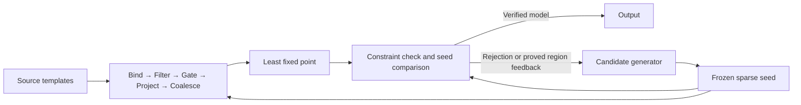

# zetesis — specification v0.2

Date: 2026-09-05  
Status: Lean-refined research specification; semantic theorems kernel-checked, device mappings remain qualification targets  
Project identity: zetesis; independent of apokrisis  
Primary implementation language: Rust  
Front end: themelios  
CPU parallelism: Rayon  
Portable GPU execution: wgpu with WGSL compute shaders  
Neuromorphic targets: SpiNNaker2 first, Loihi 2 as a specialized second mapping

Name: **zetesis**, inspired by Greek **ζήτησις**, search or inquiry. The name fits the joint work of proposing candidates and examining their consequences. [LSJ entry](https://atlas.perseus.tufts.edu/dictionaries/entry/urn%3Acite2%3Ascaife-viewer%3Adictionaries.v1%3Alsj-n46255/)

This revision supersedes v0.1. Its accompanying [Lean project](../../proofs/README.md) makes the semantic proof boundary explicit. The system name is lowercase in prose and package names; the Lean namespace follows the conventional `Zetesis` capitalization.

The current executable subset is mapped separately in [Prototype implementation](../implementation.md). This specification includes planned backends and optimizations beyond that subset.

Further refinements center the typed themelios `Program` before grounding and
solving: [input/output contracts](program-interface.md), separate
[domain analysis](domain-analysis.md), [`#show`-seeded demand and magic sets](demand-and-magic-sets.md),
and [reduct feedback, decomposition and parallel execution](feedback-and-decomposition.md).
Their notes distinguish implemented mechanisms, checked semantic laws and
remaining source/runtime refinement obligations.
The [source transformation contract](source-transformations.md) builds on
themelios's existing rewriter and surveys applicable ngo-style passes.

The forward compatibility target is now full support for the original non-clingcon `kr-domains` encodings and scenarios, including optimization. The [corpus contract](../verification/kr-domains-compatibility.md) and [Ferraris/clingo semantic extension](ferraris.md) extend the language and oracle scope beyond S0; the S0 least-closure theorems remain scoped to normalized Horn reducts.

## 1. Objective and scope of the experiment

The experiment asks whether answer-set solving can benefit from the hardware organization that makes contemporary machine learning effective: reusable computation, many parallel states, local memory, regular kernels, and sparse communication. The criterion is useful solving performance and energy efficiency. Novelty is not an acceptance criterion.

The semantic center is candidate generation followed by exact reduct computation. A candidate supplies the decisions that select a reduct. Positive inference constructs its consequences. The candidate is accepted precisely when those consequences reproduce its decisions and satisfy the constraints.

The implementation must not require a fully materialized ground rule set as the universal interface between source programs and solving. It may materialize rule instances where useful, including for reference implementations and static device circuits. It must record that materialization so its costs cannot disappear from comparisons.

This is a separate experiment from apokrisis. themelios is a shared foundation, and familiar semantic ideas can be reused after restating their contracts here. apokrisis crate boundaries, persistence formats, admission profiles, safety policies, and implementation plans are not dependencies of this specification.

The specification defines an executable semantic core, a source admission profile, an operator interface, a complete search protocol, physical backends, verification requirements, and measurable milestones. The accompanying Lean development checks central semantic and composition theorems. Hardware implementation, source-to-kernel preservation, and a performance advantage remain separate obligations.

### 1.1 Normative terms

**MUST** identifies a correctness or reporting requirement. **SHOULD** identifies the default engineering choice; a deviation needs a recorded reason. **MAY** identifies an optional optimization. Requirement identifiers are stable within this version.

An **exact** operation implements the stated finite Boolean semantics. An **approximation** carries a specified inclusion direction. An **incomplete** result means computation stopped without the requested coverage or certificate. These meanings are independent of backend.

### 1.2 Success criteria

- **EXP-1:** Returned models are stable under the admitted profile, including programs with positive cycles and cycles through default negation.
- **EXP-2:** GPU execution demonstrates whether sharing tuple structure across candidates improves complete solve time, not merely kernel throughput.
- **EXP-3:** Neuromorphic execution demonstrates whether resident state and event communication improve complete solve latency or energy, including reset, search, and termination costs.
- **EXP-4:** Resource use and exact search coverage remain observable. Sampling failure never becomes UNSAT.
- **EXP-5:** The semantic kernel, reference model, scheduler, front-end adapter, and host backends are developed in Rust. Device-specific exceptions are small, explicit, and tested.
- **EXP-6:** Candidate information drives lazy tuple/binding materialization. A successful source backend must demonstrate avoided materialization and must not enumerate the entire atom or seed carrier merely to attempt its first candidate.
- **EXP-7:** The oracle is itself a composition of specified state transformers. Its internal operations have independently testable contracts and can be fused or mapped to different hardware without replacing the acceptance definition.

### 1.3 Computational architecture

The central object is a recurrent relational program evaluated over many candidate worlds. Its state separates frozen candidate decisions, derived relations, new-tuple frontiers, and unfinished-work records. One compiled rule structure can serve many worlds and many inference rounds. A GPU representation attaches a bit mask of worlds to each shared tuple; an event representation attaches resident state to tuple keys and delivers changes to dependent operators.

The analogy with transformer-based ML is architectural: find a small compositional vocabulary, reuse its parameters and connectivity, batch independent states, and keep intermediate data near computation. Here exact variable binding supplies routing, Boolean union combines contributions, and least-fixed-point recurrence supplies inference depth. Learned features can guide proposals and scheduling; the reduct defines the oracle's truth conditions.



The hardware hypothesis is twofold: GPU worlds can share tuple structure and binding work, while a neuromorphic implementation can keep semantic state resident and communicate only relevant changes. Both are workload-dependent. Candidate divergence, broad relational joins, deep sequential recursion, device reset, and complete-search control can erase the advantage. The experiment measures these costs rather than assuming that Boolean work inherits dense ML matrix throughput.

### 1.4 Refinements established with Lean

The formalization proves the connection from normalized reduct minimality to accepted seeds, then connects lifted rule composition, lazy completion, consequence bounds, and finite coverage certificates to that definition. It also proves that finite normalized programs reach their least closure after finitely many synchronous rounds. No hardware cost model or executable round bound is inferred from that existence theorem.

The principal operational refinement is that intermediate lazy rounds need only be sound. They may omit bindings. Acceptance requires a final source-coverage argument at the current seed and derived-state snapshot, together with closure and constraint validation. A materializer is not required to finish every earlier snapshot before processing useful later work. §18 gives the checked theorem map and the remaining implementation obligations.

## 2. System boundary and development language

The system has four responsibilities:

1. Admit a themelios program into a closed experiment-owned language.
2. Compile source rules into parameterized relational operators and physical schedules.
3. Generate, refine, and exhaust candidate regions when the task requires completeness.
4. Execute and validate reduct closure using the selected backend.

Rust owns program identity, source admission, normalized data, set operations, search state, allocation budgets, serialization of experiment results, kernel generation, and device control. The semantic library SHOULD be separable into `no_std` plus `alloc` code; host integrations can use `std`. The delivered small reference model is not a claim that the embedded port is finished.

Rayon is the standard CPU parallelism mechanism. wgpu is the baseline portable GPU API. WGSL is an explicit device-language boundary; using it does not imply a second host implementation. v0 does not require Python, a machine-learning framework, or a CUDA toolchain for ordinary operation.

For native SpiNNaker2 code, Rust's Cortex-M4F target is an enabling condition, not proof of board support. Startup, linker layout, interrupt handling, router access, vendor runtime ABI, and deployment permission must pass the target qualification gate. Loihi neuron microcode is a separate device ISA: Rust may generate or configure it, but this specification does not claim that arbitrary Rust code runs on Loihi neurocores. [R1, R2]

Experiment-owned semantic crates SHOULD forbid unsafe Rust. Any required MMIO, DMA, FFI, or startup code belongs in a small target adapter with explicit invariants. This is a new design choice for this experiment, not an inherited apokrisis policy.

## 3. Source language and themelios integration

### 3.1 Dependency boundary

The inspected themelios baseline is commit `87c11a3f2b72b81a12fd53226941fdf95e7294d3`. Its workspace uses Rust edition 2024 and MSRV 1.97; the local toolchain used in this task is rustc/cargo 1.97.1. These are reproducibility observations, not a claim that the dependency's latest revision has been inspected.

Reuse themelios for source identity and diagnostics, dialect-aware lossless parsing, typed syntax access, faithful program raising, owned program values, provenance, and available structural analysis. The experiment owns its supported subset, finite universe, reduct semantics, execution plans, and device lowering.

**FE-1:** A successful parse or raise is not solver admission. Admission must examine all syntax and program variants, refusing unsupported constructs with source locations. Best-effort recovered programs are not silently executable.

**FE-2:** Inspect source syntax before raising when unsupported information can be erased by raising. In particular, program-part delimiters and directives cannot be admitted merely because the resulting owned program happens to look acceptable.

**FE-3:** Partition positive, `not`, and `not not` literals explicitly. A convenience accessor that groups negative literals is not the reduct gate definition.

**FE-4:** The owned `Program` entry point and source entry point share the same semantic admission rules. Source-only restrictions additionally inspect the syntax tree. An owned program need not be reparsed to invent missing source spelling.

The verified dependency calls are `themelios_base::source::Source::new`, `themelios_syntax::parse::parse`, and `themelios_program::raise::raise`. `Parse::has_errors()` and `Parse::diagnostics()` provide the parse gate. `raise` returns a best-effort `Raised` value: any `Raised::diagnostics()` entry refuses source admission before `Raised::into_program()` is consumed. The source-profile AST walk runs between parsing and raising. It permits only supported rule statements and supported contexts inside them; a string containing directive-like text remains a string, and the tuple node used for an atom's argument list is not confused with a prohibited tuple-valued term.

For owned input, validate statement, head, body-element, literal-negation, argument, term, and enclosed-symbol variants again. Unsupported future variants refuse. A single default `base` part with no formals is permitted; source `#program` directives are still refused before they disappear during raising. `themelios_analysis::analysis::Analysis::of` provides available structural analysis, but S0's positive-atom binding test is checked independently because library safety can support a broader language. A short verified API map is given in Appendix A.

### 3.2 Initial source profile S0

S0 deliberately isolates finite relational solving from arithmetic and language expansion:

| Construct | S0 disposition |
|---|---|
| Facts, singleton normal heads, integrity constraints | Accept |
| Ordinary atoms of either classical sign, `not a`, `not not a` in bodies | Accept; signs remain distinct atomic identities |
| Singleton unbounded choice with no local element condition | Accept; normalize as described in §4 |
| Bare named constants, strings, i32 numbers | Accept |
| Unary minus directly on a numeric literal | Accept only by the checked signed-literal rule below |
| Variables and anonymous variables | Accept subject to the safety rule |
| Equality and disequality between already bound variables/constants | Accept as exact filters |
| Multiple parts, parameterized parts, explicit `#program` directives | Refuse in S0 |
| `#const`, includes, intervals, pools, general arithmetic | Refuse in S0 |
| Function construction or compound ground terms | Refuse in S0 |
| Disjunctive heads, bounded or multi-element choices | Refuse in S0 |
| Aggregates, optimization, theory/external atoms, scripts | Refuse in S0 |
| Presentation directives such as `#show` | Refuse initially; emit full models |

The ordinary unnamed source program is the base program. Comments and whitespace have no semantic effect. Strings are decoded under the declared themelios dialect. Numeric values are i32. Bare named constants are positive, zero-argument symbolic functions in the themelios representation. The adapter must inspect both `Term` and nested `Symbol` values: a ground compound term may already be represented as a symbolic value.

An admitted normal head is an ordinary atom of either classical sign, with no default negation. A constraint has a falsum head. The atom inside an admitted singleton choice has the same restrictions. Body Boolean constants and other literal forms outside the table are refused. An admitted comparison is one non-negated equality or disequality between two scalar terms; comparison chains and default-negated comparisons are refused in S0.

The signed-literal exception evaluates only unary minus directly applied to an admitted numeric literal, using checked i32 negation. It does not authorize arbitrary constant folding. If the literal cannot first be faithfully represented by the dependency, or negation overflows, admission refuses it. In particular, this rule does not promise support for every spelling of the minimum i32 value; a dedicated boundary fixture records the accepted dependency behavior.

Every variable must occur in an ordinary body atom without default negation, of either classical sign; equality is a filter and does not introduce a binding in S0. Each anonymous variable occurrence is fresh and must satisfy the same condition. Head variables, default-negated literals, double-default-negated literals, and comparisons do not independently establish safety. A variable-free fact is admitted; a variable-bearing empty-body rule is refused.

The signed-predicate extension preserves `(sign, name, arity, argument tuple)`
as the complete atom identity. Strong negation does not mean absence of the
positive atom. The source adapter appends coherence constraints
`:- p(X1,...,Xn), -p(X1,...,Xn).` for opposite signatures present in the complete
relational templates. They introduce no missing polarity or domain product,
retain both original source origins and consume the existing admission limits.
The core `Program` does not infer these source constraints itself. In the
formula profile, coherence roots instead cover opposite complete atoms in the
completed possible-atom catalog. Neither form supplies support.

The richer formula source boundary has a clingo 5.8.2 distinction outside S0's
ordinary binding rule: default-negated anonymous positions in an unsigned atom
can be existential projections. Signed `not -p(_)` and `not not -p(_)` are
unsafe; ordinary positive-body `-p(_)` is a binder. The
[frontend profile](../../crates/zetesis-themelios/README.md) and
[reference record](../verification/strong-negation-20260906/README.md) state the
implemented source and diagnostic scope.

S0 is sufficient for graph selection, coloring encodings expressed with supported normal rules, reachability, finite configuration, and many recursive relational experiments. Richer source profiles have separate admission and preservation obligations, documented in the current frontend and Ferraris profiles. Unsupported syntax is distinct from an accepted program that exceeds a runtime budget.

### 3.3 Finite domains without a mandatory grounding pass

Let `D` be the set of admitted constant values appearing in the program and its admitted input facts. Source rules cannot construct new values in S0. For each signed predicate signature `(sign,p,k)`, its conceptual carrier is `D^k`; a nullary predicate has one tuple even when `D` is empty.

Let `A` be the finite union of these predicate carriers. This is the semantic atom universe, not an instruction to allocate it. Values carry typed identity: numeric `1`, string `"1"`, and named symbol `one` are distinct. Canonical order is constructor tag followed by signed numeric order or decoded string/name UTF-8 byte order; device IDs are assigned against this order.

**DOM-1:** Carrier descriptors support exact membership and a complete finite iterator. A backend may use conservative predicate-position subdomains only with a preservation argument that no relevant rule substitution is lost.

**DOM-2:** Discovering only the tuples selected by a generator is not a domain certificate. Unseen, false, and unmaterialized are different states.

**DOM-3:** An atom lookup outside the validated carrier is invalid input, not a new symbol insertion. Input facts are part of program identity. Updating them creates a new semantic instance in v0.

**DOM-4:** The complete fallback iterator returns `Item`, `Exhausted`, or `Interrupted(reason)`. Branching only on discovered tuples cannot certify exhaustion. Complete search eventually considers every unresolved carrier member, unless a sound bound excludes it. This obligation does not require carrier enumeration before a sparse `TrySeed` attempt; failure to finish the fallback makes the complete task incomplete.

## 4. Normalized reduct language

A normalized template consists of:

```text
head:       one atom pattern, or none for a constraint
positive:   a conjunction of ordinary atom patterns
gate_true:  atom patterns required true in the candidate
gate_false: atom patterns required false in the candidate
filters:    equality/disequality predicates on bound values
origin:     source provenance, outside semantic equality
```

A source literal `not a` adds `a` to `gate_false`; `not not a` adds `a` to `gate_true`. A singleton choice `{h} :- B` becomes a headed template with the same body and an additional `h` in `gate_true`. A normal rule with an empty body remains a fact; an empty-body choice is not a fact.

For a carrier-respecting ground substitution of rule `r`, write its positive body as `B_r`, true gates as `G_r^+`, false gates as `G_r^-`, and the Boolean conjunction of its Eq/Neq filters as `F_r`. Its gate is:

\[
g_r(z)=[G_r^+\subseteq z]\land[G_r^-\cap z=\varnothing].
\]

Let `S` be an exact finite carrier containing all atoms consulted by any gate, including constraint gates and choice heads. The default symbolic construction includes all tuples of every predicate appearing in a gate. This can contain extra atoms, which the fixed-point check will force false when they lack support. A tighter `S` is an optimization requiring a coverage argument.

A **seed** is a total assignment on `S`, represented by its true subset `z`. Any element of `S` absent from that subset is explicitly false. This closed-world interpretation applies only after the seed's exact set is established; it does not apply to an unfinished enumeration of that set.

Let `H(z)` be the positive headed rules whose filters and gates hold. Constraints are kept separately. Define:

\[
X_0=\varnothing,\qquad X_{i+1}=X_i\cup T_{H(z)}(X_i),
\qquad \Gamma(z)=\bigcup_i X_i.
\]

Since `A` is finite, this sequence stabilizes. Facts enter through empty positive bodies. The exact acceptance predicate is:

\[
\operatorname{Accept}(z)\iff
\Gamma(z)\cap S=z
\quad\land\quad
\forall c:\ \neg(F_c\land g_c(z)\land B_c\subseteq\Gamma(z)).
\]

The emitted answer set is `M = Γ(z)`. For this admitted language, its gates equal those of the full interpretation `M`, and its positive reduct has least model `M`.

**SEM-1:** No candidate bits initialize positive closure. **SEM-2:** Gates are immutable during a closure computation. **SEM-3:** Constraints never derive ordinary atoms. **SEM-4:** Ordinary neural equilibrium, low energy, approximate convergence, or repeated candidate oscillation is not acceptance or an UNSAT certificate.

### 4.1 Proof obligations

1. **Admission preservation:** the normalization of an admitted source program has precisely its stable models under the selected profile.
2. **Seed factorization:** every stable model determines a unique accepted seed `M ∩ S`, and every accepted seed reconstructs a stable model.
3. **Lifted evaluation:** template evaluation over complete positive-body matches computes the same consequence operator as conceptual grounding over `D`.
4. **Backend refinement:** physical operations implement the relevant exact operator or its declared bound.
5. **Search coverage:** exhaustive ledger closure accounts for every seed in the root carrier.

The seed-factorization proof is short: all reduct gates consult `S`, so matching on `S` makes the seed-selected reduct identical to the model-selected reduct. Least closure and satisfied constraints then give stability. Conversely, a stable model's reduct depends only on its restriction to `S` and reconstructs the model. Two accepted seeds cannot reconstruct the same full model.

This is now kernel-checked in `Semantics.lean`. Its `Stable` definition independently requires minimality among models of the positive normalized reduct, including constraints. `stable_iff_gamma` proves equivalence to least headed closure plus constraint satisfaction; `stable_iff_exists_seed` and `accepted_seed_unique` establish seed factorization and uniqueness. Source-to-normalized-rule preservation remains the first unproved adapter obligation.

## 5. Operator algebra

The implementation uses the following semantic operators. A physical compiler can fuse them; fusion must preserve their meaning.

| Operator | Input → output | Obligation |
|---|---|---|
| `Bind` | relation views + variable layout → compatible bindings | Equality of shared variables; complete matches for exact mode |
| `Filter` | bindings + Eq/Neq expressions → surviving bindings | Exact typed value comparison |
| `Gate` | bindings + frozen seed/bounds → enabled masks | Uses candidate state, not current derived truth |
| `Project` | enabled bindings + head pattern → head tuples | Existentially forgets non-head variables |
| `Coalesce` | repeated tuple contributions → set union | Idempotent OR; independent of input order |
| `Close` | operator plan + frozen gates → least positive closure | Start from bottom and process every consequence |
| `Narrow` | seed region + certified consequence bounds → smaller region | Preserve every accepted seed |
| `Split` | region + unresolved decision → two disjoint children | Exact partition of the parent |
| `Compare` | complete seed + exact closure → accept or reject | Implements §4, with constraints |

`Bind`, `Project`, and `Coalesce` are relational operations. Binary motifs can become Boolean matrix products; arbitrary arity does not imply that a dense tensor should be allocated. A cost-based physical planner chooses sorted joins, indexed probes, tiled contractions, or precompiled connectivity.

For `p(X,Z) :- q(X,Y), r(Y,Z), not blocked(X,Z)`, the derived relation update is:

\[
P_{xz}\leftarrow P_{xz}\lor
\left(\bigvee_y Q_{xy}\land R_{yz}\right)
\land\neg Z^{blocked}_{xz}.
\]

`Q`, `R`, and `P` are derived truth. `Z` is candidate truth. The shared variable `Y` is an exact join key, not an approximate embedding similarity.

### 5.1 Materialization and caching

Rules remain templates in the semantic IR. Physical caches may hold tuple indexes, binding tiles, instantiated supports, or compiled circuits. Eviction can cost time but MUST NOT remove logical obligations. A cache miss is not falsehood. A plan requiring a fully materialized support graph declares that requirement before execution.

S0 permits compiling predicates defined only by facts into immutable relations. Predicates with nonfact defining rules remain dynamic even when some of their tuples are facts. More aggressive evaluation of model-invariant components requires a dependency and preservation proof; it is not assumed from a syntactic label such as "Horn".

### 5.2 Closure scheduling

An exact lifted closure uses positive delta frontiers. For a rule with several positive atoms, scheduling must cover every join where at least one input tuple is new; duplicate matches are harmless after coalescing. Facts and rules with empty positive bodies are initial work. A complete round includes filter evaluation, head production, publication, and all spill/retry work.

Termination requires both an empty newly derived frontier and exhaustion of pending joins, publication queues, and delayed device work. The reference schedule is a complete synchronous round over all templates. Any asynchronous or semi-naive schedule must refine it.

### 5.3 Oracle composition from lower-level transformers

Here a **transformer** is a typed state transformation with a semantic contract. It need not be learned, differentiable, or a conventional attention layer. The term identifies the modular computation the hardware executes.

For a headed template `r` and fixed seed `z`, define the rule transformer:

```text
Rule_r,z(X) = Coalesce(Project_head(Gate_z(Filter_r(Bind_r(X)))))
```

`Bind_r(X)` emits all matches of positive body atoms against current derived relations and immutable input relations; an empty positive body supplies the empty binding. S0 safety ensures that remaining variables are already bound. `Filter_r` checks exact scalar constraints; `Gate_z` tests candidate membership on those bindings. Projection emits head keys, and coalescing unions multiple supports.

The positive step and oracle are compositions:

\[
F_z(X)=X\cup\bigcup_{r:\,head(r)\ne\bot}\operatorname{Rule}_{r,z}(X),
\]
\[
X^*=\operatorname{LeastFixpoint}_{\varnothing}(F_z),
\]
\[
\operatorname{Oracle}(z)=\operatorname{Compare}\left(z,X^*,
\operatorname{AnyConstraintMatch}(z,X^*)\right).
\]

`AnyConstraintMatch` uses the same bind/filter/gate pipeline followed by existential OR, without head production. `LeastFixpoint` is an explicit recurrence combinator, not a fixed number of feed-forward layers. A fixed-depth unrolling can establish acceptance only with a sufficient proved depth or a completed convergence check.

The composition vocabulary is `Then`, `ParallelUnion`, `MapWorlds`, `LeastFixpoint`, `BoundLift`, and `AtCompletion`. It supports a pipeline, repeated recurrent application, batching over worlds, and lifting to lower/upper bounds. These are proposed Rust IR operations, not dependencies on an existing neural library.

Each primitive transformer declares:

| Contract field | Required content |
|---|---|
| Input type | Key schema, bound-variable positions, candidate/closure channel, snapshot identity |
| Output type | Binding/head schema and exact, lower, upper, or untrusted-score status |
| Laws | Set meaning, monotonicity where applicable, idempotence, and valid reordering conditions |
| Completion | Which input partitions/cursors must be exhausted before output is complete |
| Resources | Capacity, scratch space, retry granularity, cancellation and overflow behavior |
| Evidence | Source template and mode binding; reference conformance cases |

**TR-1:** Composition checks schema compatibility and snapshot identity. **TR-2:** An incomplete output cannot enter a consumer that requires a complete set. **TR-3:** A complete `Gate` can be moved earlier after its arguments are bound. A partial-binding prefilter may run sooner when every enabled complete binding implies that prefilter; the full later gate is retained. Removing the later gate requires equivalence between the early predicate and the complete gate on every compatible extension. An unavailable argument is never assumed false. **TR-4:** A positive-closure channel accepts only justified consequences. Candidate bits and learned scores cannot be injected as facts.

**TR-5:** An exact fused operator replacing a recurrent pipeline preserves its output on every semantic input admitted by the contract, not just one observed execution. `fusion_preserves_least` lifts this pointwise equivalence through recurrence. A merely one-sided refinement remains explicitly a lower or upper operation; it cannot be relabeled exact because it is faster.

Hardware lowering may replace this chain by one fused GPU kernel, a collection of keyed event handlers, or a precompiled support circuit. It must preserve the composed function. Event scheduling is an incremental realization of the same transformations; a physical firing is not an additional semantic operator. Shared compiler machinery is useful, but the independent definition checker remains separately implemented to expose common compiler mistakes.

### 5.4 L0: candidate-driven lazy materialization protocol

L0 is a required source-execution capability and a primary experiment target. It is orthogonal to GPU versus CPU versus event placement. Static GPU graphs and N0 are useful baselines, but do not establish L0.

The generator and oracle share source templates and immutable relation indexes. They have separate authority over materialization:

- The **generator** may inspect selected bindings, instantiate choice opportunities, and propose a sparse complete seed or a region. Its omissions do not mean source rules are absent.
- The **oracle** evaluates every source consequence obligation that can become relevant under the frozen seed and current derived relations. It can discover atoms, supports, or violated constraints never visited by the generator.

A materialization request contains `(instance, template, frozen seed or cube identity, epoch, exact/lower/upper mode, input snapshots and frontier versions, key range, cursor)`. It returns a bounded binding/head batch, continuation cursor, and either `More` or `Drained`. `Drained` applies only to the named snapshots and key range. A cancelled or overflowing request never returns `Drained`. A candidate-local cursor cannot certify a region's upper closure unless it covers that region's may-enabled program and valid upper relations.

A continuation is committed only after its contributions have been published or recorded as explicit pending work. Retries may replay a range because coalescing is idempotent; they may not advance past an unpublished range. Failure between tuple production and publication leaves that range pending. Durable crash recovery is outside v0, but in-process retry must preserve this rule.

At an exact check:

1. Validate the complete seed against the symbolic carrier; do not enumerate that carrier.
2. Start positive closure from the empty set. Schedule every enabled empty-positive-body headed template, including facts, ground default-negated rules, and empty-body choices. Their results seed further source-template work and frontiers.
3. Bind against actual derived positive tuples. Push candidate gates and filters before expensive extensions when their variables are available. Emit consequences directly where possible, without storing ground rule rows.
4. Publish new tuple keys and masks, coalescing duplicates. New frontiers invalidate the appropriate prior `Drained` states and schedule complete delta joins.
5. Run constraint transformers as well as headed transformers, including empty-positive-body constraints.
6. Accept only after current-snapshot source coverage is established, the resulting state is closed, and §4's comparison succeeds. Exhausted relevant cursors and certified noncontributing partitions discharge coverage. Earlier incomplete rounds may contribute sound facts without certifying completion.

The coverage condition established by step 6 is:

\[
\forall r,\theta:\quad
F_{r\theta}\land g_{r\theta}(z)\land B_{r\theta}\subseteq X^*
\Rightarrow
\begin{cases}
head(r\theta)\in X^*,&\text{headed rule},\\
\text{false},&\text{constraint}.
\end{cases}
\]

The implementation can establish this condition with indexed joins over `X*`; it does not need to store or enumerate substitutions whose positive bodies fail. Finite derivation provenance plus this closure condition supplies both inclusions needed for least-model equality. A proof list containing only successful supports does not independently establish this universal condition.

**LAZY-1:** Neither constructing a first seed nor its verification may require allocating all of `A`, all of `S`, or the entire ground rule set merely for indexing. Exact symbolic descriptors and sparse true sets are admissible representations.

**LAZY-2:** Exact verification is driven by all source templates, not only generator materialization. A rule omitted from a proposal can still reject it.

**LAZY-3:** Candidate gate failure can eliminate a binding for the current seed; that elimination is invalidated when its gate inputs change. In a region upper bound, only definitely impossible gates may be excluded.

**LAZY-4:** Bindings, tuples, support rows, indexes, and devices have separate counters for attempted, materialized, resident, and reused work. Laziness is measured by avoided work/materialization, not simply the absence of a file called a ground program.

**LAZY-5:** Completed source-obligation coverage accounts for every partition and spill/retry cursor, either by processing it or by a valid noncontribution argument. An unvisited partition without such an argument blocks acceptance. Coverage is tied to the current derived relations and frozen seed; it does not survive their change automatically.

**LAZY-6:** The formal operational acceptance contract is `completed_lazy_stage_accept_sound`: all emitted stages are justified consequences; the final selected bindings cover every source binding that can fire at that snapshot; the final materialized transformer produces no atom outside the current result; constraint coverage is complete and no constraint triggers; the result X satisfies `X ∩ S = z` for a complete gate carrier S. Together these imply stability. Arbitrary earlier omissions are allowed because they do not inject unjustified atoms.

L0 does not promise small models, cheap joins, or reduced worst-case complexity. A positive program can require an enormous least model, and some constraints require substantial joins to exclude all violations. The intended win is avoiding the larger candidate-independent possibility expansion where the selected reduct makes most of it irrelevant.

## 6. Partial candidates and abstract reduct closure

A candidate region is a cube `[L,U]` with `L ⊆ U ⊆ S`. It represents all total seeds `z` satisfying `L ⊆ z ⊆ U`. This is an exact family of assignments, not a vector of marginal probabilities.

For each rule define:

\[
g_r^{lo}=[G_r^+\subseteq L]\land[G_r^-\cap U=\varnothing],
\]
\[
g_r^{hi}=[G_r^+\subseteq U]\land[G_r^-\cap L=\varnothing].
\]

Let `D_lo` and `D_hi` be least closures of the headed programs containing only filter-satisfying instances selected by these gates. Then, for every seed in the region:

\[
D_{lo}\subseteq\Gamma(z)\subseteq D_{hi}.
\]

Consequently:

\[
\operatorname{Narrow}(L,U)=
(L\cup(D_{lo}\cap S),\ U\cap(D_{hi}\cap S)).
\]

If the new lower bound is not a subset of the new upper bound, the region contains no accepted seed. The same conclusion follows if a filter-satisfying, definitely enabled constraint has its entire positive body in `D_lo`.

This construction does not require `Γ` to be antimonotone and therefore applies to the admitted choices and double negation. The upper program can combine rules whose gates cannot be simultaneously enabled by one seed; this weakens the bound but does not make it unsound. Contradictory true/false gates may be normalized to false. No stronger correlation claim is made.

### 6.1 Bounded work and approximation direction

**BND-1:** A partial derivation from bottom supplies a valid lower bound. It may force positive decisions but cannot establish absence.

**BND-2:** A partially executed closure from bottom is not a valid upper bound. An upper result must be a completed upper closure, a validated post-fixpoint of the upper program, or a known containing carrier. In particular, backend budget exhaustion cannot be interpreted as removal from `U`.

**BND-3:** Narrowing may stop early with weaker valid bounds. Complete-seed acceptance still requires the exact §4 computation.

**BND-4:** A cache is bound to the semantic instance, region, gate interpretation, and closure direction. Descending into a child cube can reuse proved parent lower and upper bounds. Reusing closure across unrelated seeds requires a separate proof or reset.

Reused upper state stays typed as `Upper`; it cannot initialize an exact closure from above after rules are disabled. For `{s}. a :- s. a :- b. b :- a.`, removing the selected `s` makes exact closure empty. Starting from the previous `{a,b}` support cycle can retain an incorrect fixed point. Exact recomputation starts from bottom unless a separate deletion/derivation-preservation proof applies.

These rules permit a hardware scheduler to spend a bounded amount of work on propagation before splitting. They prevent expensive upper closures from becoming mandatory before every decision.

## 7. Candidate generation and complete search

### 7.1 Exact baseline

The root is `[∅,S]`. Maintain an explicit tree of region transformations. For each open region:

```text
compute valid bounds under the current budget
narrow, recording why eliminated assignments cannot be accepted
if inconsistent or definitely violates a constraint: close as refuted
else if L == U: run exact Compare and close as accepted or rejected
else choose a ∈ U \ L and create:
    true child  [L ∪ {a}, U]
    false child [L, U \ {a}]
```

The default decision is the first unresolved atom in canonical order; the default traversal is depth first. These choices make the reference deterministic. Work stealing may change execution and emission order, but not model identity or coverage. This is the complete coverage engine; it is not a requirement to assign every conceptual atom before trying a sparse candidate.

### 7.1a Sparse `TrySeed` before carrier expansion

The source runtime MUST support `TrySeed(z)` for a finite, complete true set `z ⊆ S`, represented by an exact membership function with false as the explicit complement. The first default proposal is `z=L` when the current lower set is available, starting with the empty seed at the root. A policy may provide another valid finite set satisfying `L ⊆ z ⊆ U`. This constructs a total assignment without visiting every false tuple.

Run the lifted exact oracle immediately; do not first enumerate `S`, branch to singleton bounds, or fully compute the candidate-independent upper possibility closure. Bounded propagation can run before the trial when useful, but it must be able to retain the carrier itself as a weak upper bound. Later trials are triggered by a new seed, useful feedback, or a changed region, not an unbounded repetition of the same failed proposal.

For `FindOne`, an accepted trial fulfills the task with partial coverage. For complete tasks, the baseline treats trials as observations: they do not retire their enclosing region. Every accepted output, whether from a trial or ledger traversal, passes through one serialized exact seed-key check, capacity reservation, and delivery commit. This includes concurrent workers and repeated trials. Reserve an in-flight entry before delivery; mark it in `SeenAccepted` only after successful delivery to the owned result stream. Other workers cannot emit the same in-flight key. Interrupted delivery remains pending or makes the run incomplete; the engine does not silently discard it. When the coverage engine later reaches an already emitted seed, it validates/reuses the bound evidence and retires the singleton without duplicate emission. Membership uses full exact seed identity, not a hash alone. A rejected trial refutes only that seed unless further evidence refutes a larger region.

If storage for `SeenAccepted` cannot be reserved, disable speculative emission in complete mode and use normal ledger traversal, or return incomplete. An implementation must not emit an untracked speculative model and then silently duplicate or omit it. Observational trials can be suspended without affecting coverage; all ledger regions still require sound closure.

An optional later search representation may subtract accepted/rejected points symbolically from regions. That requires its own exact partition proof; it is not necessary for v0's observational protocol.

**COV-1:** Every split creates both children and commits them atomically. **COV-2:** A region is retired only with accepted-singleton, exact-rejection, or sound-refutation evidence. **COV-3:** Dropping a queued region due to resource limits makes the run incomplete. **COV-4:** A hash or a device success flag alone is not a mathematical refutation certificate.

The baseline ledger has node variants `Open`, `Split`, `Narrowed`, `Accepted`, and `Refuted`. A `Narrowed` edge records the inclusion-preserving argument for the retained child. Exhaustion is structural: every path from the root ends at a justified terminal node. It does not require representing the integer `2^|S|`.

The complete generator is also a composed program: `BoundLift(Close) → Narrow → Split`, interleaved with `TrySeed → Oracle → certified feedback`. A heuristic can replace scheduling and seed proposal without changing those contracts. This makes generation and checking share relational transformations while preserving their different duties: proposing one interpretation and accounting for an entire search space.

### 7.2 Learned or heuristic policies

Policies may rank decisions, choose a child to visit first, select a physical schedule, choose the amount of bound computation, form candidate batches, or propose which conflict conditions to relax. Their outputs are checked against the current region and capability limits.

An initial policy need not be trained. Future neural policies SHOULD consume rule structure and relational features, preserve the distinction between exact identities and learned features, and be evaluated on held-out instance sizes. No particular network architecture or training library is a v0 dependency.

For an exploratory `FindOne` task, a policy may propose complete seeds directly. Every proposal is exactly checked. For complete enumeration or UNSAT, proposals must also be integrated into the coverage ledger or treated as additional observations that do not retire unexplored regions. v0's simplest complete policy chooses branch order rather than inventing overlapping speculative regions.

### 7.3 Reusable feedback

A rejected singleton may be generalized by relaxing seed decisions and rerunning sound region refutation. A relaxation is retained only if the larger cube is still proved impossible. A refuted cube `[L,U]` yields the valid exclusion:

\[
\bigvee_{a\in L}\neg a\ \lor\ \bigvee_{a\in S\setminus U} a.
\]

No minimality requirement is imposed on that exclusion. When a region expression makes it expensive to list the clause, retain the region as a predicate instead. Learned exclusions are bound to the program and domain identity; they do not cross input changes without a preservation proof.

A finite support derivation can also give a sufficient gate condition `C ⇒ q ∈ Γ(z)` and, for `q ∈ S`, the valid condition `¬C ∨ q`. Failure to find a support is not an analogous certificate. The baseline can use whole-seed rejection and cube refutation without implementing arbitrary nogood learning.

## 8. Data model and Rust interface

### 8.1 Identity and storage

- `ValueId(u32)` indexes a canonical typed-value table. Checked admission refuses an unrepresentable table; it never truncates an ID.
- `PredicateId(u32)` identifies `(name, arity)`.
- `AtomKey` is `(PredicateId, value tuple)`; no global dense atom table is required.
- `TemplateId(u32)` identifies a normalized rule template. Ground support identity includes its substitution when one is materialized.
- Host semantic sets may be explicit sorted keys or immutable exact set expressions over carriers, unions, intersections, and differences. Every representation supplies exact membership and a complete fallible iterator. Lack of allocated storage does not supply a false answer.
- Device-local tuple and rule IDs are compact indices into a particular tile or circuit. Maps back to semantic keys travel with the plan.

S0 does not require an astronomical carrier cardinality to fit in a machine integer. Iterators may use lexicographic tuples. Allocation sizes and device indices do require checked machine-size bounds. A planning failure to represent a physical plan is a capability/resource result, not semantic UNSAT.

### 8.2 Proposed crate layout

The proposed package names share the zetesis prefix; semantic API terms such as reduct and oracle retain their descriptive meanings.

```text
crates/
  zetesis-core/        admitted language, gate algebra, keys, regions, outcomes
  zetesis-themelios/   source/Program adapter, diagnostics, provenance
  zetesis-plan/        relational operator IR, physical plans, capacity checks
  zetesis-reference/  independent small definition-based interpreter
  zetesis-cpu/        scalar lifted evaluator + bounded Rayon execution
  zetesis-search/     coverage ledger, policies, exact feedback validation
  zetesis-wgpu/       Rust wgpu control, buffers, WGSL kernels, profiling
  zetesis-events/     portable integer event machine and deterministic simulator
  zetesis-spinnaker/  qualified no_std firmware/SDK adapter
  zetesis-loihi/      qualified microcode/circuit compiler and runtime adapter
  zetesis-cli/        task configuration, results, benchmark runner
```

`zetesis-core` does not depend on themelios, Rayon, wgpu, vendor SDKs, or a learning framework. The adapter converts from themelios into owned core data. Device backends depend on the operator contracts, not on parser internals. The reference implementation must not reuse optimized closure code as its acceptance authority.

### 8.3 API contract sketch

These signatures specify ownership and outcomes; names are proposed, not claims about an existing library.

```rust
pub enum Task {
    FindOne,
    EnumerateAll,
    EnumerateUpTo { limit: NonZeroU64 },
}

pub struct RunControl {
    // Owned budgets and a cancellation/deadline interface.
    // Host/device bytes, queue entries, work, outputs, and time are separate.
}

pub enum Bound<T> {
    Exact(T),
    Lower(T),
    Upper(T),
}

pub enum CheckResult {
    Accepted { model: Model, evidence: AcceptanceEvidence },
    Rejected { evidence: RejectionEvidence },
    Incomplete { reason: IncompleteReason },
}

pub trait ReductBackend {
    fn capabilities(&self) -> Capabilities;
    fn bounds(&mut self, plan: &BoundPlan, region: &Region,
              control: &mut RunControl) -> Result<BoundsResult, BackendError>;
    fn check(&mut self, plan: &CheckPlan, seed: &Seed,
             control: &mut RunControl) -> Result<CheckResult, BackendError>;
}
```

`Seed`, `Region`, admitted programs, and physical plans have private fields and validated constructors. A complete `Seed` is different from a generator still producing tuples. Lower and upper results cannot be substituted for exact closure merely because they share a representation.

Every plan carries the normalized-program/domain identity, operator version, physical backend requirements, exact/bound mode, and index-map identity. Every execution entry validates those bindings. Current budgets are supplied to admission, planning, compilation, loading, solving, and evidence replay; historical metadata never authorizes unbounded current work.

### 8.4 Outcomes and model delivery

A solve report separates:

```text
knowledge:       ModelFound | NoModelProved | Undetermined
task_status:     Fulfilled | Interrupted
coverage:        Exhausted | Partial
termination:     Found | Exhausted | Limit | Budget | Cancelled | BackendFailure
models_emitted:  count of full stable models delivered successfully
backend:         requested policy and actual execution/residency profile
```

`FindOne` may be fulfilled with partial coverage. `EnumerateAll` is fulfilled only on exhaustion. Reaching an `EnumerateUpTo(k)` limit fulfills that bounded request but usually leaves coverage partial; exhausting earlier also fulfills it. If zero models have been found, only justified exhaustion sets `NoModelProved`. A crash or lost hardware state preserves already certified results only when the report can establish they were committed before the fault; otherwise the affected result is invalidated.

Full models are canonical sorted atom keys. v0 does not project models through `#show`, which avoids conflating distinct stable models. An output sink applies backpressure. Ledger retirement and successful model delivery are coordinated so a failed sink does not silently omit an enumeration result. Deterministic emission is optional and may need buffering; canonical identity is mandatory.

## 9. CPU backend and Rayon

The scalar implementation is always available for development, small instances, and semantic comparison. The optimized CPU backend shares immutable program/index data and uses an explicitly bounded Rayon pool for independent regions, candidate batches, and sufficiently large relation partitions. Use `ThreadPoolBuilder` to set a nonzero worker count and `ThreadPool::install` to run within that pool; no unbounded implicit global pools are required. The independent definition-based reference remains distinct. [R11]

**CPU-1:** Avoid nested unbounded parallelism. A top-level worker budget is shared by parsing batches, planning, search, and verification. **CPU-2:** Mutable candidate state is owned by one job or partitioned explicitly. **CPU-3:** Set unions and reductions are order-independent; nondeterministic discovery order does not alter atom identity or exact output. **CPU-4:** Cancellation is polled between bounded work units.

Small joins SHOULD run serially when task overhead dominates. Parallelizing every tuple is not a requirement. The benchmark runner must report the configured thread count and CPU resources used by all backends.

**CPU-5:** A worker bound is not a queued-memory bound. Pending jobs, region state, result buffers, and join scratch consume separate admission credits. Prefer bounded chunks and cooperative backpressure to spawning one job for every conceptual candidate. A task must reserve its required transient state before its parent advances a work cursor.

## 10. GPU execution profile

### 10.1 Portable wgpu baseline

Use wgpu's native compute support with WGSL and u32 bit operations. A relation tile stores shared tuple columns plus `ceil(B/32)` world-mask words per tuple, where `B` is batch width. Inactive tail bits are zero and all complements are intersected with the active-lane mask. A tuple can be true in different subsets of worlds; those worlds are never merged into an averaged interpretation.

A typical matching contribution is:

```text
out_mask(head) |= mask(q_tuple) & mask(r_tuple) & gate_mask(binding)
```

Candidate gate masks and derived relation masks live in distinct buffers. Lower and upper region evaluation use distinct logical channels. The physical layout SHOULD keep masks contiguous for the selected warp/workgroup access pattern; the planner may tile both tuple and candidate axes.

wgpu is the portability baseline, not a promise of identical performance across Metal, Vulkan, and D3D12. Backend features, workgroup limits, buffer limits, shader version, driver, and adapter identity are part of each result. [R2]

### 10.2 Kernel contracts

GPU phases are bind/probe, filter/gate, project, coalesce, publish delta, and convergence accounting. Implementations may fuse adjacent phases where their synchronization is local. Atomic OR is valid for identical-key contributions; tuple allocation still requires a collision-safe index and capacity protocol.

**GPU-1:** A workgroup barrier is not a global barrier. Global closure steps use explicit dispatch/publication boundaries with validated visibility and separate frontier buffers. Workgroups must not spin waiting for unscheduled workgroups.

**GPU-2:** Device output capacity is explicit. Overflow sets a checked failure flag before any out-of-range write. The engine retries a smaller tile, spills with complete accounting, or returns incomplete. It never drops tuple contributions.

**GPU-3:** A host may submit several safe closure rounds before reading a completion flag. This amortizes readback without asserting convergence early. The batch must still cover all required relational work.

**GPU-4:** Resident gates, indexes, closures, and frontier state SHOULD survive across dispatches. Per-candidate host readback is avoided. Fully device-resident search is a separate capability from device closure; §12 labels it honestly.

**GPU-5:** The union of tuple keys across candidate worlds can itself grow. Batching policies must measure this expansion and split cohorts when sharing costs more than it saves.

**GPU-6:** The world-to-lane map is immutable during an epoch. Compaction occurs only at a publication boundary and remaps every candidate, derived, frontier, bound, and region mask consistently before the next epoch starts. Lane positions are physical addresses, not persistent candidate identities.

**GPU-7:** The mathematical batch is a product of isolated worlds. `least_batch` proves that its closure at each world equals the independent closure of that world. Shared tuple keys and indexes may reduce work; truth from another world cannot become an antecedent or gate. Proving WGSL word operations, padding, index publication, and compaction implement this product remains a device-lowering obligation.

### 10.3 Numerical and specialized kernels

Packed Boolean execution is the exact baseline. A dense numerical Boolean product can use `C_ij = Σ_k A_ik B_kj` followed by `C_ij > 0` only when its input encoding, accumulation range, rounding behavior, and overflow policy prove equivalence. Body conjunction implemented as a count equality needs an equally explicit bound. Floating-point tolerances never define acceptance.

A vendor-specific backend may exploit matrix instructions after passing these obligations and demonstrating a workload benefit. It is not required for the initial wgpu implementation. The physical planner compares memory traffic, arithmetic intensity, launch cost, and intermediate cardinality rather than equating all tensor-shaped work with peak matrix throughput. [R3]

## 11. Neuromorphic execution profiles

### 11.1 N0: static support graph

N0 admits an exact finite support graph compiled from templates and static input. Its nodes represent atom state and multi-antecedent rule state; routes represent dependencies. The compiler may fuse unary dynamic-body rules into routes, avoiding an explicit rule node where equivalent.

Each atom has a derived latch. Each enabled rule has a count of unsatisfied distinct positive antecedents and a fired latch. Each constraint has corresponding state and a rejection destination. Candidate gate state is separate. Counters and latches use exact digital operations with proved ranges.

An epoch has the following ordered state machine:

```text
Idle → DrainPrevious → Reset → ConfigureGates → GateBarrier
     → SeedFacts → Propagate → ProveCompletion → Check → Commit → Idle
```

No gates change between `GateBarrier` and `Check`. Reset sets each rule's remaining count to the number of its distinct grounded positive antecedents and clears fired flags, atom state, constraint state, and pending work from the preceding candidate. An empty-body rule starts with remaining count zero. Configuration messages are not positive derivation messages. Errors enter `Faulted` and cannot produce acceptance.

During propagation, the first derivation of atom `a` sets its latch and emits one logical `Derived(a, epoch)` event. Each dependent enabled rule receives that antecedent once, decrements its counter, and fires its head once on reaching zero. Atom latches coalesce heads derived by several rules. Empty-body enabled rules initiate work. Constraints signal rejection rather than introducing an atom.

**EV-1:** Body atom occurrences are deduplicated after substitution, before counters are assigned: two different patterns can become the same ground atom. **EV-2:** Message delivery is lossless under the admitted load, or loss is detected and the candidate is retried/refused. **EV-3:** Duplicate delivery is prevented, deduplicated by `(epoch, world, rule instance, antecedent atom)` logical identity, or treated as a detected fault; it never decrements a counter twice. **EV-4:** A stale epoch cannot affect current state. **EV-5:** Pending messages, delayed events, and scheduled handlers participate in completion detection.

At completion, comparison can scan `Γ(z) ∩ S` or use a deduplicated matched-seed counter. If an `S` atom derives with a false candidate bit, the candidate may be rejected immediately. Acceptance additionally requires that every true seed atom derived and that no constraint fired. Early rejection must still drain or invalidate pending work before reusing resources.

The event-refinement proof follows finite derivations: every emitted atom is justified by previously derived antecedents, so the emitted set lies in the least model. At valid completion every enabled satisfied rule has fired, so the set is closed and contains the least model. Together these imply equality.

`Events.lean` checks this argument for abstract finite atom-publication traces. The trace must be legal at each intermediate state, and completed traces must be semantically closed. It does not prove that every permutation is legal or that empty hardware queues establish closure. Duplicate atom publication is idempotent in the proof model; duplicated rule-edge counter decrements remain subject to EV-3 and are not justified by that theorem.

### 11.2 Completion protocol

The first implementation uses explicit logical rounds. Each round completes all messages and handlers admitted to it before the next round is committed. Global absence of newly derived atoms after a complete round, with no pending work, establishes closure. A known conservative number of rounds may substitute only when its proof accounts for the physical implementation's rule and transport delays.

An asynchronous distributed termination detector is optional. It must account for sends, receives, local queues, in-flight traffic, and concurrently generated work under a documented protocol. Local quietness or a time-based "settling" heuristic is not sufficient.

On hardware offering finite FIFOs, the selected overflow mode must preserve delivery or report a fault. A drop/overwrite configuration intended for neural traffic is not an admissible logical transport. Backpressure design must avoid deadlock, for example through reserved control capacity and a proved progress schedule.

### 11.3 N1: dynamic relational events

N1 adds keyed tuple stores and incremental joins. A tuple arrival is indexed by exact bound values, combined with all compatible stored tuples, projected, and deduplicated. Simultaneous arrivals must not miss pairs. Creating a support after some antecedents already derived must initialize from the current epoch's atom state and subscribe without a lost-event race.

N1 is a target capability, not a claim about Loihi neurocores. Preallocating every compatible binding can recreate the grounding memory problem; using an embedded core to perform joins is valid but must be reported as that physical placement. Pool exhaustion triggers bounded retry, backpressure, or incomplete execution.

### 11.4 SpiNNaker2 target

SpiNNaker2's programmable ARM M4F processing elements, local SRAM, and event routing are a plausible target for `no_std` Rust event handlers, exact joins, queue management, and search control. Its chip paper documents 152 processing elements and support for event-based computation beyond conventional neural models. [R4]

The qualification gate must establish: a Rust image boots; ABI/startup/linking are correct; event receive/send and interrupt paths work; FIFO mode is configured; overflow is observable; barriers and timers are characterized; memory ownership is valid; host-independent epochs can run; and the service permits custom native code. Rust ISA support alone does not discharge any of these device obligations.

If needed, a narrow vendor C ABI shim may supply startup or routing access. Core logic remains Rust. An original SpiNNaker port is an alternative where its public native API is easier to access, but it is a separately measured target with a different firmware toolchain. [R5]

### 11.5 Loihi 2 target

Loihi 2 supports programmable digital neuron microcode, local state, integer and bitwise operations, comparisons, and graded spikes. These support an investigation into exact gate/counter/latch circuits. Graded spikes participate in synaptic weighted accumulation; they must not be assumed to expose arbitrary software packet headers. [R6]

Use explicit synchronized reset/configure/run/check phases for the first mapping. Prove counter ranges, input-channel separation, thresholds, atom latch behavior, and the relation between logical rounds and hardware timesteps. Do not use leaky state, spontaneous spiking, approximate thresholds, or online modification of oracle weights in the exact channel.

Candidate proposal dynamics may be stochastic or learned, but the frozen-candidate interface and acceptance circuitry remain exact. On-chip learning of proposal behavior is optional. It cannot mutate semantic gates or support dependencies.

Loihi 2 cost must include neuron updates and barriers even when few neurons spike. Sparse logical events are not a guarantee of activity-proportional physical cost. Placement, memory reads, and communication hotspots are measured explicitly. [R7]

### 11.6 Available alternatives and selection rationale

The following is a target shortlist, not a statement that this task has obtained hardware access. Suitability is an engineering inference from the documented programming models.

| Platform | Documented route and programming boundary | Role in this experiment |
|---|---|---|
| SpiNNaker2 | Institutional access/purchase; some native software repositories require access [R4] | First exact event target, conditional on native firmware qualification |
| Original SpiNNaker | Public native packet API; EBRAINS service route with service-specific permissions [R5] | Practical alternative for event semantics and controller experiments |
| Loihi 2 | Research-community hardware route; Lava is archived and a successor SDK is under development [R6, R8] | Specialized exact circuit mapping; confirm current access/tooling before committing |
| BrainScaleS-2 | Analog neural core with digital control processors; EBRAINS research access [R5, R9] | Candidate dynamics with digital checking; exact oracle acceleration needs a separate mapping |
| BrainChip Akida | Documented neural-model deployment to devices; virtual devices and CPU fallback also exist [R9] | Proposal/ranking accelerator; the exposed model interface does not establish a general exact event engine |
| Innatera Pulsar | Commercially announced SNN/CNN MCU with RISC-V control and Talamo tooling [R9] | Small embedded hybrid experiment; Rust firmware and exact accelerator access need qualification |

For BrainScaleS-2 and Pulsar, placing the entire oracle on the conventional digital core is possible as a design direction, but would not by itself demonstrate a benefit from their neural fabric. Their value should be judged by the contribution of that fabric to useful candidate generation or exact operators. The initial Rust/wgpu/Rayon development path remains independent of obtaining any research chip.

### 11.7 First native search controller

The first native implementation uses the finite N0 graph and a device-resident coordinator. Its admitted seed carrier has a checked dense local index; this is an explicit static-profile restriction. The coordinator owns the depth-first region stack, frozen seed, epoch sequence, output reservations, and bounded coverage records. It may initially use the carrier as a weak upper bound and no optional propagation, then invoke the exact event oracle for trials and singleton leaves.

The controller issues reset/configure/run commands, receives a completed exact oracle result, records acceptance or rejection, and chooses the next region entirely on-device. Workers never modify the seed. Outputs and evidence may stream to the host through bounded buffers; the host supplies no per-candidate search decision or missing oracle computation. If stack, ledger, output, or transport capacity is exhausted, the controller pauses under a valid backpressure protocol or reports incomplete. H0 must establish that the selected chip's management or processing cores can run this controller; it is not assumed to fit a neuron microprogram. Later device bounds and N1 joins replace specific operators after conformance tests.

## 12. Placement, native execution, and capability reporting

Every run reports one of the following residency classes, together with a per-operation placement map:

| Class | Meaning |
|---|---|
| `HostReference` | Host computes all semantic operations |
| `DeviceOracle` | Device computes exact closure/check; host controls candidate search |
| `DeviceSearch` | Candidate control and exact checking run on the selected device/SoC after loading |
| `MixedPlacement` | Binding, propagation, search, or verification spans processors; report each placement |

For a neuromorphic SoC, embedded general-purpose cores count as on-device, but their work is distinguished from neurocore work. A native solver claim requires `DeviceSearch`, reliable device control, and no per-candidate host oracle or host search decision. It does not require parsing to occur on the chip. A stochastic device search can be native while incomplete; native execution and completeness are orthogonal claims.

`RequireBackend` refuses when the requested backend/capability is unavailable. `Auto` may select another backend, but the report exposes the actual route. A simulator is labeled a simulator. wgpu-on-CPU software adapters do not count as GPU measurements.

The mathematical operators are shared across targets. Memory layout, scheduling, placement, and control strategy are allowed to differ. A compiler must not force an inefficient physical correspondence merely to make the implementations look alike.

## 13. Resource, failure, and evidence contract

All public work is budgeted: parsing/raising, admission, plan construction, compilation, allocation, relation expansion, candidate queues, event queues, search, output, and evidence replay. Bounds use checked arithmetic. A program can be semantically admitted while a requested physical plan is unavailable.

Cancellation is cooperative at bounded work boundaries. Device cancellation must specify whether work is drained or invalidated, and resources are reused only after that protocol completes. A timeout, capacity overflow, queue loss, numerical fault, or device loss cannot be mapped to rejection of a candidate unless a valid rejection was independently established before the failure.

Acceptance evidence identifies the program/domain, complete seed, reconstructed model, backend/kernel versions, and completed check. Optional independently checkable evidence consists of well-founded finite derivations plus a complete closure/constraint validation against the source semantics. One encoding gives every derived atom a rule/substitution witness and a rank; every ordinary positive antecedent has a strictly smaller rank. Facts and enabled empty-positive-body rules initiate the ranks. A candidate gate, including a choice's `not not` head gate, is checked against the frozen seed and is not an ordinary positive antecedent. A finite cyclic support graph alone is insufficient: `a :- a` cannot certify `{a}`. Derivations establish membership in least closure; universal rule/constraint validation excludes omitted consequences. Hashes bind evidence to data but do not prove its content.

The initial executable prototype uses in-process validated values and test evidence. Persistent checkpoints, hostile-input proof envelopes, crash-consistent distributed ledgers, and portable external certificate formats are separate features; v0 makes no claim that a hash of an arbitrary serialized state safely resumes exhaustive search.

## 14. Verification and adversarial fixtures

Verification has independent levels:

1. A tiny full-interpretation definition checker constructs each candidate's reduct directly and computes least closure.
2. A seed checker uses §4's factorization.
3. A region engine uses §6–7's narrowing and splitting.
4. An event engine computes closure under varied reliable delivery orders.
5. The lifted interpreter is compared with explicit finite grounding on small source instances.
6. Rayon, wgpu, and qualified devices are compared against independent reference results.

Optimized backends must not all share a faulty precomputed rule table in tests meant to validate source binding. Source-level tests need independent substitution enumeration. Whole-model equality, not just model counts, is the baseline comparison.

| Fixture | Expected result or invariant |
|---|---|
| Empty program | One stable model: empty |
| `a.` | One model `{a}` |
| `a :- a.` | One model: empty |
| `a :- not a.` | No stable model |
| `a :- not b. b :- not a.` | Exactly `{a}` and `{b}` |
| `{a}. b :- a. u :- u. :- not b.` | Exactly `{a,b}` |
| `:-.` | No stable model |
| Duplicate positive body occurrences | Same result as deduplicated body; counters use distinct atoms |
| `a :- not not a.` | Empty and `{a}` |
| `p(a). :- p(X), X != a.` | Exactly `{p(a)}`; false comparison must disable the constraint instance |
| `:- 1 != 1.` / `:- 1 = 1.` | Empty model / no model, respectively; Bind's empty-input unit and constraint filters apply |
| Gate containing both `a` and `not a` | Never enabled for a complete seed |
| Deep positive chain | No acceptance before final derivation/completion |
| Two supports for one atom | One derived latch transition and one logical fanout event |
| Late materialized support | Previously derived antecedents are not lost |
| More than 32 candidate lanes, partial final word | No contamination by inactive tail bits |
| Full FIFO, duplicate/stale event, device capacity exhaustion | Correct retry or explicit failure; no false acceptance |
| Reused state after changing a gate | Same answer as fresh closure |
| Rule whose head was absent from a proposed tuple list | Oracle still discovers the head if derivable |
| `dom(a). q(X) :- dom(X), not p(X). :- q(a).` with empty seed | Oracle discovers `q(a)` and rejects even if the generator never instantiated either rule |
| Huge symbolic `D^k` gate carrier, sparse accepted seed | `TrySeed` performs no carrier-wide false-bit allocation or enumeration |
| Diagonal gate predicates over an n-value domain | Empty seed check touches only O(n) derived tuples despite the conservative O(n²) seed carrier |
| Two-domain join gated by a singleton selected value | Bound-gate pushdown avoids the n² pair expansion while checking a nonempty seed |
| A partially drained join followed by a new input frontier | Old drained status cannot establish current closure |

The accompanying [Rust reference](../../validation/reference/README.md) supplies small finite ground kernels and a bounded structured-template interpreter. The [recorded executable campaign](../../validation/reference/test-results.json) compares 65,312 ground programs, 234,811 seeds, 704,433 event schedules, and 545,136 cubes. Separate Cargo tests compare lifted evaluation with independently enumerated grounding and exercise faults and admission boundaries. These are finite regression checks, not a general proof.

The executable also records the following exact lifted fixtures. Probe counts include all synchronous closure passes; source substitutions are the analytical binding space of the fixture's target rule.

| Fixture | Domain size | Symbolic seed atoms | Target source substitutions | Derived atoms | Tuple probes |
|---|---:|---:|---:|---:|---:|
| Diagonal carrier | 32 | 2,048 | 32 | 64 | 128 |
| Candidate-gated pair | 32 | 32 | 1,024 | 34 | 192 |
| Diagonal carrier | 128 | 32,768 | 128 | 256 | 512 |
| Candidate-gated pair | 128 | 128 | 16,384 | 130 | 768 |

Each check performs zero carrier-tuple enumeration and retains zero ground rule rows. The source is supplied through structured Rust templates. This reference does not validate themelios S0 parsing, complete lifted search, production cursor/index scheduling, Rayon execution, shaders, device timing, or hardware performance. §15 distinguishes the meaning of the two fixtures and the larger experiments still required.

## 15. Performance experiment

### 15.1 Workload families

Start with fixed graph selection plus recursive reachability. This creates an observable divide between static connectivity and candidate-dependent gates and has meaningful positive closure. Then vary graph size, density, degree skew, recursive depth, decision count, candidate similarity, and number of repeated tasks over one resident topology.

Add dynamic two-relation joins, wider rule bodies, positive SCCs, odd/even negative cycles, and unsatisfiable instances. Include cases where shared tuple unions become dense and where upper bounds combine mutually incompatible supports. These are expected stressors, not benchmark exclusions.

A required lazy family has a large static domain, optional selected edges represented through supported choice gates, and recursive paths through only selected edges. For example, `chosen(X,Y) :- edge(X,Y), not not chosen(X,Y)` generates only candidate-selected edges during exact closure, followed by `path(X,Y) :- chosen(X,Y)` and `path(X,Z) :- path(X,Y), chosen(Y,Z)`. Compare against a candidate-independent possibility expansion. Include constraints that force nonempty selection so that only finding an empty answer is not the entire benchmark. Vary candidate density while holding the source/domain fixed. The comparison records scanned bindings as well as stored rows: avoiding storage while still scanning the entire expansion is a different result.

Two smaller fixtures isolate distinct requirements. With n explicitly supplied `dom` facts, `{pick(X,X)} :- dom(X). seen(X,X) :- dom(X), not ban(X,X).` has a conservative seed carrier of size `2n²`; checking the empty seed needs only the n domain and n seen tuples. This tests the absence of mandatory carrier enumeration; an effective classical grounder can also exploit the diagonal syntax. Separately, `{pick(X)} :- dom(X). pair(X,Y) :- dom(X), dom(Y), not not pick(X), not not pick(Y).` with one selected value derives n domain facts, one pick, and one pair. Testing the first gate as soon as X is bound avoids extending rejected X bindings across every Y. Compare its measured binding work with explicit n² pair-rule substitutions. These isolate semantic and planning behavior; end-to-end performance claims additionally require the larger constrained workloads above.

### 15.2 Comparisons and accounting

Compare: independent scalar reference on small cases; optimized scalar/Rayon CPU execution; GPU candidates with separate versus shared bindings; event simulator; qualified SpiNNaker2/Loihi 2 runs; and an established ASP solver as an external benchmark baseline on the common language. External solvers are comparison tools, not hidden execution routes.

Record two modes: cold one-shot time including parse, compilation, placement, loading, solving, and output; and warm repeated solves with explicitly amortized setup. A new fact set changes semantic identity even if the physical topology is reused. Report the amount of reuse and its validation cost.

Measure:

- time to first verified model, time to exhaustive completion, and timeout rate;
- candidates checked, regions split/refuted, closure rounds, and inference events;
- tuple matches, distinct tuple keys, materialized supports, peak memory, and bytes transferred;
- CPU thread use, GPU dispatch/readback time, device occupancy indicators where available;
- event routing volume, congested links, queue occupancy, reset/configuration cost, and completion overhead;
- total and dynamic energy where instruments permit, with measurement boundary, idle baseline, and host consumption stated;
- full-model correctness and exact coverage status for every timed run.

A useful decomposition is `setup + generation + binding + gate/configuration + closure + completion + feedback + output`. Moving a cost to a host or setup phase does not remove it. Hardware speedup and reduction in search work are reported separately.

#### Required CPU/GPU evaluation contract

Publish a route matrix for optimized scalar CPU, Rayon at specified worker
counts, physical Metal, and subsequently qualified NVIDIA devices through the
actual selected API. Include one-thread clingo and a separately configured
multithread clingo baseline on the same host. Record CPU workers used by GPU
routes. Requested and actual backend, grounder and oracle are separate fields;
hardware unavailability, unsupported source profiles, resource interruption and
fallback remain visible, rather than disappearing from the matrix.

Every solver receives the same original source/include bytes, constants and
semantic task. First answer, exhaustive enumeration, optimum certification and
enumeration of all optimal ties are distinct tasks. Complete answer-set parity
requires canonical stable-model identities, counts, objective priority vectors
and optimal ties, alongside original source contracts and output-channel checks.
Displayed-model multisets alone cannot establish hidden-atom parity: existing
reports retain this limitation until a full-model capture interface is qualified.
Validate every measured execution outside its timed region.

Report complete source-to-answer wall time separately from static-oracle and
kernel measurements. One-shot timing includes parsing, construction, candidate
generation, materialization, reduct checks, objectives, device initialization,
compilation, transfer, synchronization, readback and output. Resident runs
disclose retained state, setup cost, the number of amortized tasks, semantic
identity checks and rebuild/reset costs. Compare equivalent reuse opportunities
and identify unsupported reuse. A first-observed process run is not a cold-cache
measurement; a cold-cache claim requires its own controlled protocol. Keep host
timers and device timestamps distinct.

Record process peak RSS, authored host/device allocation accounting and physical
device-memory telemetry as different quantities. Unavailable measurements carry
a reason, not zero or a configured limit. On unified-memory hardware, do not sum
overlapping host/device quantities as though they were disjoint. Record transfer
bytes, batch width, dispatches, occupancy where available, and the actual
division of work between host and device.

Use unchanged corpus cases and preregistered parameterized families covering
size, density, recursion depth, selectivity, candidate similarity, batching,
satisfiable/unsatisfiable cases and optimization. Include eager versus
candidate-directed grounding and measured eager-expansion growth. Count scanned
bindings and materialized tuples/rules alongside time and memory; theoretical
substitution counts alone do not establish a clingo grounding problem. Sweep
the expected CPU/GPU crossover and include cases where GPU overhead or dense
intermediate state loses. Tune on separate instances.

Preserve all repetitions, warmups, failures, limits, commands, tool/source/binary
hashes and hardware/software identities. Counterbalance execution order, pause
competing builds/tests and report distributions. If clingo cannot complete a
larger case, retain its timeout or memory failure and mark cross-solver parity
there unavailable. Qualify smaller members and record independent native
correctness/completion evidence. A reference failure supplies neither a finite
speedup ratio nor an UNSAT result. Publish CPU and GPU results together,
including unsupported and losing cases. These are evaluation requirements;
the current single-worker CPU comparison runner does not implement the entire
matrix.

### 15.3 Decisions driven by results

Keep a backend when it improves a preregistered workload under equal correctness and task requirements, or supplies a useful energy/latency tradeoff. Selectivity, batch width, placement, and thread counts are tuned on separate instances from the final report. No universal speedup target or invented hardware advantage is asserted in v0.

## 16. Implementation sequence and completion gates

| Gate | Deliverable | Required evidence |
|---|---|---|
| M0 | Rust definition, seed, cube, and event reference | Exact model-set equivalence on exhaustive/random small kernels; adversarial fixtures |
| F0 | Lean semantic specification and proof-to-requirement map | Kernel-checked proofs, axiom audit, and explicit remaining refinement obligations; delivered with v0.2 |
| M1 | themelios S0 adapter and scalar lifted evaluation | Every syntax disposition tested; direct grounding equivalence; signed-value/part-erasure regressions |
| M2 | Bounded complete search and Rayon CPU backend | Coverage tree checks; cancellation/output failures; deterministic identity across schedules |
| M3 | wgpu exact static-support baseline | Shader differential tests, capacity/tail-bit tests, real adapter identification |
| M4 | wgpu shared-binding lifted engine with L0 | Independent source equivalence; sparse TrySeed; resumable source cursors; complete materialization accounting; lazy/eager and batching ablations |
| H0 | Device access and Rust/toolchain qualification | Native image or generated circuit runs; memory/event/fault contracts measured |
| M5 | Native static event solver on a qualified target | Device-controlled candidate epochs and exact check; loss/duplicate/termination tests |
| M6 | Dynamic event joins where supported | No missed pairs/late supports; allocation and backpressure correctness |
| M7 | Learned scheduling or proposal policy | Same acceptance authority; held-out improvement including training/setup cost |

H0 should run early in parallel with M0–M2, because access or SDK constraints may determine the feasible neuromorphic target. M3 and event development can proceed independently after the semantic kernel stabilizes. M4 is the principal test of candidate-driven lazy materialization; it cannot pass merely by omitting a stored ground-program artifact. M5 is the principal test of native neuromorphic solving. N0 may pass M5 while still requiring prior support materialization; native lazy neuromorphic solving additionally requires L0/N1 or a proved template specialization that avoids that materialization. M7 is optional and is not needed to justify the operator architecture.

### 16.1 Explicit open decisions

- Exact GPU join/index strategy and device batch policy: benchmark-selected after correctness baselines.
- SpiNNaker2 Rust startup/runtime ABI and permission to load arbitrary firmware: hardware qualification required.
- Loihi 2 instruction/state/channel mapping and current successor SDK: access-dependent; no existing Rust backend claimed.
- Best global completion protocol beyond the round-based baseline: proof and device measurements required.
- Whether learned proposals offer enough benefit to repay their inference/training cost: empirical question.
- Later arithmetic, aggregates, disjunction, and incremental semantic updates: new profiles and proofs, not implicit extensions of S0.

The specification is ready to guide the reference kernel, source adapter, CPU scheduler, and initial GPU/event prototypes. It is not a frozen device ABI or a claim that a production ASP language is already supported.

## 17. Hardware and dependency evidence

Sources checked on 2026-09-05. Architecture suitability statements in this document are engineering inferences from these sources, not published ASP benchmark results.

- **R1 — Rust embedded target:** [rustc support for thumbv7em-none-eabi/eabihf](https://doc.rust-lang.org/rustc/platform-support/thumbv7em-none-eabi.html). Cortex-M4F support and bare-metal core/alloc are documented; board/runtime integration is separate.
- **R2 — wgpu:** [Rust API and supported shader/backends](https://docs.rs/wgpu/latest/wgpu/). At inspection the documentation displayed 30.0.1. Resolve and pin a tested version when the GPU crate is implemented.
- **R3 — GPU performance:** [NVIDIA matrix multiplication guide](https://docs.nvidia.com/deeplearning/performance/dl-performance-matrix-multiplication/index.html). Supports the arithmetic-intensity and tiling basis of the physical cost model.
- **R4 — SpiNNaker2:** [2026 chip paper](https://arxiv.org/abs/2607.24396); [official software catalog](https://spinnaker2.gitlab.io/external/documentation/software/); [access requirements](https://spinnaker2.gitlab.io/external/get_started/requirements/). Institutional purchase/access is available; some low-level repositories are private and general individual cloud access is described as forthcoming.
- **R5 — Original SpiNNaker:** [public native packet API](https://spinnakermanchester.github.io/spinnaker_tools/spin1__api_8c.html); [EBRAINS neuromorphic infrastructure](https://ebrains.eu/data-tools-services/computing-infrastructure/neuromorphic-computing). Hosted access does not automatically authorize arbitrary native code.
- **R6 — Loihi 2:** [Intel technical brief](https://download.intel.com/newsroom/2021/new-technologies/neuromorphic-computing-loihi-2-brief.pdf); [Lava synchronization protocols](https://lava-nc.org/lava/lava.magma.core.sync.protocols.html). Distinguish asynchronous circuit organization from application synchronization.
- **R7 — Loihi runtime:** [A Compute and Communication Runtime Model for Loihi 2](https://arxiv.org/abs/2601.10035). Model includes local work, memory, communication, and synchronization.
- **R8 — Current Loihi tooling:** [Lava repository announcement](https://github.com/lava-nc/lava). Lava repositories were archived in May 2026; Intel states that a successor architecture and SDK are under development. No successor availability is assumed here.
- **R9 — Other platforms:** [BrainScaleS-2 architecture](https://pmc.ncbi.nlm.nih.gov/articles/PMC8907969/), [Akida programming model](https://doc.brainchipinc.com/user_guide/akida.html), [Innatera Pulsar architecture](https://www.innatera.com/product/), [Pulsar commercial launch and developer program](https://www.innatera.com/newsroom/innatera-unveils-pulsar-the-worlds-first-mass-market-neuromorphic-microcontroller-for-the-sensor-edge/). These are additional candidate-generation or hybrid targets, not established native exact-reduct backends.
- **R10 — Relevant algorithmic foundations:** [sparse linear-algebraic stable-model computation](https://arxiv.org/abs/2009.10247), [Neural Logic Machines](https://arxiv.org/abs/1904.11694), [alternating fixpoint semantics](https://www.sciencedirect.com/science/article/pii/002200009390024Q), [Loihi 2 QUBO search](https://arxiv.org/abs/2408.03076). The experiment evaluates hardware suitability rather than asserting novelty of these ingredients.
- **R11 — Rayon:** [ThreadPoolBuilder](https://docs.rs/rayon/latest/rayon/struct.ThreadPoolBuilder.html), [ThreadPool::install](https://docs.rs/rayon/latest/rayon/struct.ThreadPool.html#method.install). Pool sizing and pool-scoped execution support the bounded CPU backend; queued-memory accounting remains experiment-owned.

## 18. Lean refinement and assurance boundary

The [Lean package](../../proofs/README.md) pins Lean **4.33.1** and imports only its standard library. `lake build` checks every semantic module imported by the umbrella. The [proof record](../../proofs/verification.json) identifies the current theorem count and exact source hashes. [Audit.lean](../../proofs/Audit.lean) prints the transitive axiom dependencies of every theorem; the [recorded audit](../../proofs/axiom-audit.txt) contains only standard Lean logical axioms where needed: propositional extensionality, quotient soundness, and classical choice. No project axioms, proof holes, `sorryAx`, or native-evaluation proof shortcuts are used.

The formalization is a mathematical specification. It does not extract or verify the Rust implementation, compile WGSL, or prove a vendor runtime correct. Lean is a development assurance tool; normal zetesis execution does not acquire a Lean dependency.

### 18.1 Representation and scope

`Atoms α` is a membership predicate `α → Prop`. This deliberately avoids assuming any dense representation. `Rule α` contains finite positive and gate lists, an optional head, and a filter proposition. `Program α` is a finite list of normalized ground rules. This list is a conceptual reference in the semantic proofs, not a required runtime intermediate.

The transformer least closure is the intersection of all closed sets. Monotonicity makes that intersection closed and a fixed point. A separate finite-body proof connects it to the union of finite synchronous iterations. A finite ground program has only finitely many heads, yielding a common finite convergence stage even when the surrounding atom type is infinite. This does not supply an executable stage bound or justify stopping a partially executed round.

Lifted templates are indexed by abstract binding types. `ConceptualGrounding` states that membership in the conceptual ground program is exactly instantiation of the entire headed/constraint registry. The bridge proves equality of the resulting consequence and constraint semantics. It assumes this source-registration contract; it does not prove the themelios adapter establishes it. In particular, a variable-free empty positive body must have the intended singleton empty substitution supplied by source normalization. Arbitrary abstract binding types do not enforce that source property themselves.

### 18.2 Checked theorem map

Names below are relative to the `Zetesis` namespace. Subsequent unqualified names in the same table cell inherit the first name's nested namespace. See [theorems.json](../../proofs/theorems.json) for the complete source/line index.

| Requirement | Principal checked results | Exact scope |
|---|---|---|
| Least positive reduct model | `Semantics.stable_iff_gamma` | Minimality among normalized reduct models equals least headed closure plus satisfied constraints |
| Guess only reduct-selecting atoms | `Semantics.stable_iff_exists_seed`, `accepted_seed_unique` | Bijection between accepted seeds and stable models when S covers every gate |
| Recurrent transformer semantics | `least_closed`, `least_fixed`, `fusion_preserves_least` | Monotone closure and replacement by pointwise-equivalent operators |
| Finite inference | `Semantics.gamma_iff_finiteIter`, `finite_normalized_program_converges` | Every consequence has a finite derivation stage; finite normalized programs have a common convergence stage |
| Rule composition and grounding bridge | `Lifted.composition_exact`, `LiftedBridge.family_consequence_ground`, `family_constraints_ground` | Relational composition matches all registered conceptual instances and constraints |
| Lazy materialization | `LiftedBridge.lazy_stage_sound`, `completed_lazy_stage_exact`, `completed_lazy_stage_accept_sound` | Earlier omissions preserve soundness; final source coverage, closure, constraints, and seed agreement establish stability |
| Early gates | `Lifted.gate_pushdown_exact`, `necessary_gate_pushdown_exact` | Equivalence permits gate replacement; implication permits an early prefilter with the full gate retained |
| Candidate batching | `least_batch` | Closure of isolated product worlds equals independent closure in every world |
| Partial candidates | `Bounds.gamma_sandwich`, `acceptance_survives_narrowing` | Must/may reduct closure encloses every candidate and preserves accepted seeds |
| Regional refutation | `Bounds.inconsistent_narrowing_refutes`, `lower_constraint_refutes`, `lower_prefix_constraint_refutes` | Concrete sound refutation conditions, including a discovered definite constraint before full lower closure |
| Search coverage | `CoverageTree.mem_outputs_iff`, `outputs_nodup`, `exhausted_no_valid` | A supplied completed certificate has exactly the valid seeds in its root region, without duplicate leaves |
| Event schedules | `completed_events_exact`, `completed_events_order_independent` | Finite legal atom-publication traces agree when their final state is semantically closed |
| Completed clause validation | `ClauseValidation.scan_accepts_iff`, `validate_accepts_iff`, `validate_work_bound` | Short-circuit scans preserve existential clause/universal CNF truth for a fixed total interpretation; counted work covers queried literals, not SAT state construction or Rust resource accounting |
| Signed identity and coherence | `StrongNegation.reduct_rename`, `stable_target_iff`, `coherence_stable_filter`, `compiled_stable_of_pair_coverage`, `bounded_group_stable_in_context` | Injective atom encoding preserves exact reducts/stability; a complete registry filters opposite pairs without support; bounded groups retain their original formula structure and context |

The coverage theorem is connected to reduct semantics: `Bounds.coverage_narrowed` supplies the search constructor's required force conditions from actual must/may closure. It does not replace those premises with a sampled candidate result. Arbitrary region-refutation leaves still require valid local evidence from a concrete checker.

### 18.3 Contracts sharpened by the proofs

**FM-1 — Seed support.** Agreement on S alone does not exclude true candidate atoms outside S. A public seed constructor validates `z ⊆ S`; accepted seeds satisfy it by theorem. All gates, including those occurring only in constraints, must be covered. `Examples.missing_constraint_gate_loses_model` proves that omitting a constraint gate can lose a stable model.

**FM-2 — Two-sided completion.** An exact result X needs both `X ⊆ Γ(z)` and semantic closedness `T_z(X) ⊆ X`. The first is established by justified construction from bottom; the second excludes omitted consequences. `exact_of_sound_and_closed` proves equality. Closed cyclic support without justified construction is insufficient.

**FM-3 — Final coverage.** Runtime materialization need not satisfy a global exactness contract on unvisited states. The operational proof requires coverage only at the final snapshot, after any finite sequence of sound partial rounds. The implementation must preserve pending work or establish noncontribution; this theorem does not permit losing an obligation and then asserting coverage.

**FM-4 — Snapshot change.** Coverage is indexed by seed and derived state. `Lifted.grown_snapshot_not_covered` and `omitted_new_consequence` prove that a previously empty match set can gain a consequence after a new tuple arrives. Reusing a drained status across that change needs revalidation.

**FM-5 — Bound direction.** Finite forward prefixes are lower approximations. A valid upper set is closed under the may-enabled consequence operator or has another independently proved enclosing property. `Bounds.closed_upper_sound` supplies this route. Gamma is not assumed antimonotone; `Examples.choice_gamma_not_antimonotone` gives a normalized singleton-choice counterexample.

**FM-6 — Safe fusion and sharing.** Compiler equivalence is quantified over semantic input states and compatible bindings. An equality observed on a test run does not establish a rewrite law. GPU sharing preserves per-world slices. Physical Boolean masks, addresses, hashes, and queues require an additional representation relation.

**FM-7 — Completion certificates.** A finite `CoverageTree` has no constructor turning an open, interrupted, or sampled region into a complete one. A rejected sample can coexist with an accepted seed; an accepted sample can coexist with another accepted seed. Both claims have one-atom counterexamples in `Search.lean`. Concurrent output reservation and `SeenAccepted` delivery remain runtime protocols beyond this tree proof.

**FM-8 — Event legality.** An atom publication is justified using the state before that publication. Reordering is valid when it preserves this legality. The proofs tolerate repeated set insertion, not arbitrary duplicated transport effects. Reliable delivery, counter bounds, reset barriers, and the connection between device quiescence and semantic closedness remain explicit hardware obligations.

**FM-9 — Signed identities and pair coverage.** Strong negation is encoded as a distinct atom, while default negation remains implication to falsum. `StrongNegation.coherence_frozen` proves that a coherence constraint is true under every tested reduct interpretation exactly when the candidate omits its conflicting pair. Consequently it cannot supply support. Global coherent stability requires the explicit `PairCovered` premise: every opposite pair co-present in a candidate is registered. A sound possible-atom enclosure and complete pair registry suffice; a one-polarity carrier need not invent its opposite. `omitted_registry_admits_incoherence` demonstrates why partial coverage is insufficient. These laws do not prove the actual Rust registry, source safety or themelios translation.

### 18.4 Remaining proof and implementation work

| Boundary | Still required |
|---|---|
| themelios → normalized source/kernel | Parser admission, safety and domain construction, signed identity/value handling, singleton-choice lowering, and complete coherence/template/constraint registration |
| Relational contracts → Rust | Prove or independently validate the actual term substitution, indexes, cursors, key equality, resource failures, and final-coverage checker |
| Predicate worlds → wgpu | Prove exact masks, tail-bit exclusion, publication, capacity recovery, synchronization, and lane remapping implement isolated worlds |
| Legal traces → neuromorphic execution | Prove the rule-counter transport machine refines atom traces and its completion protocol implies source closedness |
| Completed search tree → solver | Construct valid certificates, preserve outstanding regions across interruptions, prove finite traversal under the source carrier assumptions, and verify output commit/deduplication |
| Semantic convergence → practical termination | Derive executable bounds or trusted completion tests and prove bounded work, cancellation, and backend scheduling progress |
| Semantic permission → performance | Measure enumeration avoided, total search work, memory, latency, and whole-system energy on actual implementations |

These are the next refinement targets, rather than assumptions that the Lean build has verified all of zetesis. The Rust differential tests remain useful independent evidence. They are not a formal refinement proof from Lean, and the Lean theorems are not empirical speedup evidence.

## Appendix A. Verified themelios API map

Paths are relative to the inspected themelios repository and pinned to the commit in §3.1. They identify existing dependency APIs; proposed experiment types in §8 are separate.

| Function or representation | Implementation reference |
|---|---|
| `Source::new(SourceId, String)` | `crates/themelios-base/src/source.rs:171` |
| `parse(&Source, Dialect)` | `crates/themelios-syntax/src/parse/mod.rs:306` |
| `Parse::syntax`, `diagnostics`, `has_errors` | `crates/themelios-syntax/src/parse/mod.rs:184`, `:203`, `:209` |
| `raise(&Parse)` | `crates/themelios-program/src/raise.rs:696` |
| `Raised::program`, `diagnostics`, `into_program` | `crates/themelios-program/src/raise.rs:752`, `:758`, `:763` |
| `Term` variants | `crates/themelios-program/src/term.rs:25` |
| `Symbol::Number(i32)`, string, symbolic function | `crates/themelios-program/src/symbol.rs:41` |
| Unary expression raising / numeric-leaf range check | `crates/themelios-program/src/raise.rs:391`, `:599` |
| `Body::negative` groups `not` and `not not` | `crates/themelios-program/src/program/rule.rs:475` |
| `Analysis::of` and structural accessors | `crates/themelios-analysis/src/analysis.rs:53` |

The adapter's source-level admission policy must be exhaustive over syntax kinds and context-sensitive over structural containers. The program-level policy must return `UnsupportedConstruct` for future non-exhaustive enum variants. Preserve all parsed origins through normalization; provenance is not part of model truth or canonical semantic identity.

## 19. Forward semantic profile

Full support for the original non-clingcon kr-domains cases is the compatibility
target. The [Ferraris/clingo extension](ferraris.md) specifies general
formula-reduct minimality and retains S0 Horn closure as a specialization. The
[corpus contract](../verification/kr-domains-compatibility.md) records the 94
required runnable cases. Native search proposes classical candidates and checks
proper-subset models of their frozen reducts. Lifted objectives rank only verified
stable models. The [verification record](../verification/status.md) identifies
implemented source constructs, complete original-case results and measured
hardware boundaries; incomplete profiles are not full compatibility.

The [Lean development](../../proofs/README.md) covers the reduct criterion,
frozen-mask equivalence, guard preservation, objective reduction, query
compaction and candidate-coverage contracts. Source translation, runtime limits,
Rust search and shaders require separate implementation evidence. A semantic
lemma is not a substitute for source admission or physical hardware validation.

## Structural analysis

The [program-analysis integration](program-analysis.md) consumes established
themelios dependency and classification facts under explicit expansion and
analysis limits. The solver retains witnesses and the exact analyzed program.
Those facts can justify general scheduling and specialization decisions while
stable-model acceptance remains a reduct obligation.

## NVIDIA DGX target

Access to an unspecified NVIDIA DGX system is available for future qualification.
The [DGX execution target](dgx.md) defines GPU residency, multi-device coverage,
complete-search acceleration and reproducible measurement obligations. This
adds a hardware target without changing the reduct acceptance criterion or
claiming a device backend that has not run.

## Incremental sessions

Multi-shot execution is a possible Rust API extension, separate from the present
single-shot milestone and from lazy candidate generation. The
[incremental-session contract](incremental-sessions.md) specifies program versions,
update invalidation, current-reduct acceptance and reuse evidence. Python/Lua
scripting and theory atoms are not prerequisites for that extension.
